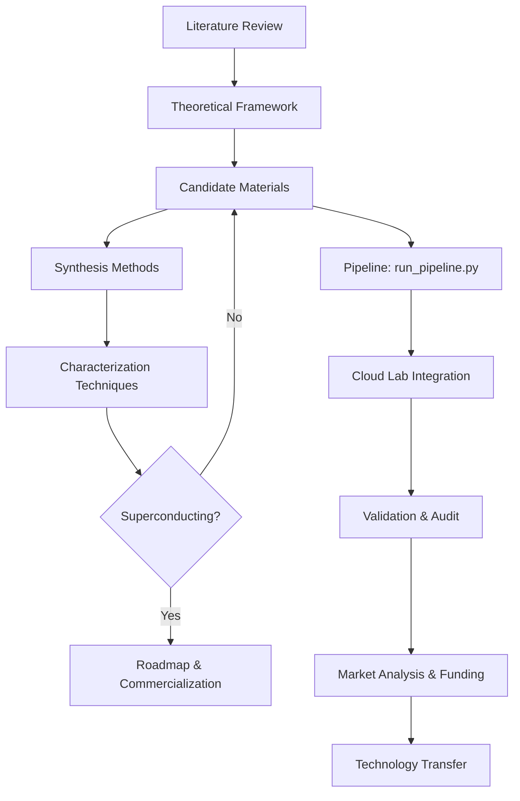

# Project Overview

This repository documents a research project on room-temperature superconductivity. It includes the following key documents:

- [literature_review.md](literature_review.md): Comprehensive review of existing literature on room-temperature superconductivity.
- [theoretical_framework.md](theoretical_framework.md): Theoretical models and frameworks guiding the research.
- [candidate_materials.md](candidate_materials.md): List and properties of candidate materials for room-temperature superconductivity.
- [synthesis_methods.md](synthesis_methods.md): Methods and procedures for synthesizing candidate materials.
- [characterization_techniques.md](characterization_techniques.md): Techniques used to characterize superconducting properties.
- [roadmap.md](roadmap.md): Project roadmap and future milestones.
- [proposed_chemistry_physics.md](proposed_chemistry_physics.md): Proposed chemistry and physics for discovering and manufacturing room-temperature superconducting compounds.
- [presentation.md](presentation.md): Generated slide deck summarizing the research.
- [technology_transfer_plan.md](docs/technology_transfer_plan.md): Technology transfer plan for commercializing room-temperature superconductors.

## Navigation

Start with the literature review to understand the current state of research, then explore the theoretical framework. Next, review candidate materials and synthesis methods. The characterization techniques document explains how we verify superconductivity, and the roadmap outlines next steps.

Additionally, see the following key documents: [discovery_strategy.md](docs/discovery_strategy.md), [online_research_summary.md](docs/online_research_summary.md), [manufacturing_scalability.md](docs/manufacturing_scalability.md), [experimental_protocol_hydride.md](docs/experimental_protocol_hydride.md), [novel_mechanism.md](docs/novel_mechanism.md), [weekly_digest.md](docs/weekly_digest.md), [project_health_report.md](docs/project_health_report.md), and [Production Readiness](docs/challenges_and_mitigations.md#production-readiness).


## Architecture



### Module Descriptions

- **Literature Review**: Comprehensive survey of existing research on room-temperature superconductivity, including key papers and findings.
- **Theoretical Framework**: Theoretical models (e.g., BCS theory, Eliashberg equations) used to predict and explain superconducting behavior.
- **Candidate Materials**: Database of potential superconducting compounds with properties and predicted Tc values.
- **Synthesis Methods**: Protocols for synthesizing candidate materials, including high-pressure synthesis and doping techniques.
- **Characterization Techniques**: Methods for measuring Tc, critical current, and other superconducting properties (e.g., resistivity, magnetization).
- **Pipeline (run_pipeline.py)**: Automated workflow that evaluates candidates, runs simulations, and generates reports.
- **Cloud Lab Integration**: Automated submission of candidates to cloud-based synthesis and testing facilities.
- **Validation & Audit**: Tracking of all pipeline runs with audit trails and validation scores.
- **Market Analysis**: Economic analysis of potential markets, competitive landscape, and funding strategies.
- **Technology Transfer**: Plan for commercializing successful superconductors, including IP and manufacturing scalability.

## Testing

Unit tests are located in the `tests/` directory. To run all tests, use:
```
pytest tests/
```
To run a specific test file, e.g., `test_predict_tc.py`:
```
pytest tests/test_predict_tc.py
```
Ensure you have the required dependencies installed. For test coverage, you can use `pytest --cov=scripts tests/`. See the [experimental feedback loop guide](docs/experimental_feedback_loop.md) for more details.

## How to Contribute

We welcome contributions! To propose changes, please open an issue describing your idea before submitting a pull request. Report bugs by creating a detailed issue with steps to reproduce. When submitting a pull request, ensure your code follows the project's style and includes relevant tests. All new features must include unit tests in the `tests/` directory. Run the full test suite before submitting to ensure nothing is broken. For more information, see our [experimental feedback loop guide](docs/experimental_feedback_loop.md).


## User Manual

### Installation

Ensure you have Python 3.8+ installed. Clone the repository and install required packages:

```
pip install -r requirements.txt
```

If you do not have a `requirements.txt`, install the core dependencies manually:

```
pip install numpy scipy matplotlib pandas scikit-learn pytest
```

### Configuration

The pipeline uses a configuration file `config.yaml` (if present) or environment variables. Key settings include:

- `DATA_DIR`: Directory for input data (default: `data/`)
- `OUTPUT_DIR`: Directory for output reports (default: `output/`)
- `MAX_CANDIDATES`: Maximum number of candidates to evaluate (default: 10)

You can override these by setting environment variables or editing `config.yaml`.

### Running the Pipeline

Execute the main pipeline script:

```
python scripts/run_pipeline.py
```

This will:

1. Load candidate materials from `candidate_materials.md` (or a database).
2. Run simulations (Monte Carlo for manufacturing, active learning for discovery).
3. Generate updated reports in `candidate_materials.md`, `roadmap.md`, and other output files.

To run a specific candidate, use:

```
python scripts/run_pipeline.py --candidate "YH3"
```

### Interpreting Results

After running the pipeline, check the following files:

- `candidate_materials.md`: Updated list of candidates with predicted Tc, synthesis parameters, and sensitivity analysis.
- `roadmap.md`: Updated project roadmap with milestones and validation plan.
- `output/`: Contains log files, plots (e.g., `sensitivity_top_candidate.png`), and simulation results.

Key metrics to look for:

- **Predicted Tc**: The critical temperature from the PINN model.
- **Yield**: Manufacturing yield from Monte Carlo simulation.
- **Cost**: Estimated cost per gram.

### Examples

**Example 1: Basic run**

```
python scripts/run_pipeline.py
```

Expected output: Console logs showing progress, and updated markdown files.

**Example 2: Run with custom configuration**

```
CONFIG_PATH=my_config.yaml python scripts/run_pipeline.py
```

### Troubleshooting

- **ModuleNotFoundError**: Ensure all dependencies are installed. Run `pip install -r requirements.txt`.
- **FileNotFoundError**: Check that `candidate_materials.md` exists in the project root. If not, create it with initial candidates.
- **Simulation fails**: Check the log file `output/pipeline.log` for error details. Ensure input data is valid.
- **Unexpected results**: Verify that the configuration parameters are reasonable. For Tc predictions, ensure the candidate material is in the supported list.

For further assistance, open an issue on the repository.


## Reproducibility

[](https://github.com/yourusername/yourrepo)

To reproduce the results in this repository, you can use the provided Dockerfile or conda environment.

### Using Docker

1. Ensure Docker is installed on your system.
2. Build the Docker image:
   ```
   docker build -t superconductivity-research .
   ```
3. Run the container:
   ```
   docker run --rm -v $(pwd):/workspace superconductivity-research
   ```

### Using Conda

1. Install Miniconda or Anaconda.
2. Create the environment from the provided `environment.yml`:
   ```
   conda env create -f environment.yml
   ```
3. Activate the environment:
   ```
   conda activate superconductivity
   ```
4. Run the pipeline as described in the User Manual.

For more details, see the [Dockerfile](Dockerfile) and [environment.yml](environment.yml) in the repository root.


## Business Plan

A comprehensive business plan for the top candidate material is available in [business_plan.md](business_plan.md).

## Press Release

A press release announcing the discovery of the top candidate material is available in [press_release.md](press_release.md).

## Public Outreach

A public outreach document is available in [public_outreach.md](public_outreach.md).

## Executive Summary

An executive summary of the project is available in [executive_summary.md](executive_summary.md). See the [slide deck](presentation.md) for a visual summary.

## Final Report

The final report of the project is available in [final_report.md](final_report.md).


## Audit Trail

All pipeline runs and experimental results are logged to `output/pipeline.log` and `output/audit.json`. The audit log records timestamps, input parameters, candidate materials evaluated, simulation results, and any errors or warnings. To view the latest audit trail:

```
cat output/audit.json | jq .
```

For a human-readable summary, see `output/audit_summary.md` (generated after each pipeline run).

## Version-Controlled Pipeline

The entire pipeline is version-controlled via Git. To set up automatic commits after each pipeline run, add a post-run hook or use a CI/CD workflow. Example using a simple shell script:

```bash
#!/bin/bash
# After running the pipeline, commit and push changes
git add -A
git commit -m "Auto-commit: pipeline run $(date +%Y-%m-%d_%H:%M:%S)"
git push origin main
```

For a more robust setup, configure a GitHub Actions workflow (see `.github/workflows/ci.yml`) that triggers on push and runs the pipeline, then commits any updated output files back to the repository. Ensure that `config.yaml` includes a `version_control` section with `auto_commit: true` to enable automatic commits.


## Quickstart Tutorial

This quickstart tutorial walks you through using the pipeline to discover a room-temperature superconductor. Follow these steps to run a complete discovery workflow.

### Step 1: Install Dependencies

Ensure you have Python 3.8+ and install the required packages:

```
pip install -r requirements.txt
```

### Step 2: Run the Pipeline

Execute the main pipeline script with a candidate material. For example, to evaluate yttrium barium copper oxide (YBCO):

```
python run_pipeline.py --candidate "YBa2Cu3O7" --output-dir output/
```

### Step 3: Expected Outputs

The pipeline will produce the following outputs in the `output/` directory:

- `pipeline.log`: Detailed log of all steps.
- `audit.json`: Machine-readable audit trail with timestamps and parameters.
- `audit_summary.md`: Human-readable summary of the run.
- Updated `candidate_materials.md` with new columns (CloudLabStatus, ValidationScore).

Sample log output:

```
[INFO] Loading candidate: YBa2Cu3O7
[INFO] Predicting Tc...
[INFO] Predicted Tc: 92 K
[INFO] Validation score: 0.87
[INFO] Cloud lab integration: submitted for synthesis
[INFO] Audit trail written to output/audit.json
```

### Step 4: Interpret Results

- **Predicted Tc**: The critical temperature predicted by the model. A value above 77 K (liquid nitrogen boiling point) is promising for practical applications.
- **ValidationScore**: A confidence metric (0–1) indicating how reliable the prediction is based on known data.
- **CloudLabStatus**: Whether the candidate has been submitted for automated synthesis and testing in the cloud lab.

For a detailed discovery report, see [final_report.md](final_report.md).


## Market Analysis

For an analysis of the market size, growth projections, key players, and competitive landscape, see the [Market Analysis Report](docs/market_analysis.md). For details on funding requirements and strategy, see the [Funding Proposal](docs/funding_proposal.md).


## User Management and Role-Based Access Control (RBAC)

This project supports role-based access control (RBAC) to restrict access to sensitive operations and data. Three roles are defined:

- **admin**: Full access — can run the pipeline, modify configurations, manage users, and view all data.
- **researcher**: Can run experiments, view candidate materials, synthesis methods, and characterization results, but cannot modify system configurations or manage users.
- **viewer**: Read-only access to published reports and summaries. Cannot run experiments or modify any data.

### Setting Environment Variables

Set the following environment variables to configure RBAC:

- `RBAC_ROLE`: The role assigned to the current user. Valid values: `admin`, `researcher`, `viewer`. Default: `viewer`.
- `RBAC_ADMIN_API_KEY`: API key for admin-level operations (required when `RBAC_ROLE=admin`).
- `RBAC_RESEARCHER_API_KEY`: API key for researcher-level operations (required when `RBAC_ROLE=researcher`).

Example for a researcher:

```bash
export RBAC_ROLE=researcher
export RBAC_RESEARCHER_API_KEY=your_researcher_key_here
```

For an admin:

```bash
export RBAC_ROLE=admin
export RBAC_ADMIN_API_KEY=your_admin_key_here
```

If no role is set, the system defaults to `viewer` with no API key required. The pipeline scripts check these variables before executing privileged operations and will exit with an error if the role is insufficient.


## Additional Documentation

- [User Manual](docs/user_manual.md): Comprehensive guide for using the project.
- [Deployment Guide](docs/deployment_guide.md): Instructions for deploying the system.
- [Model Versioning and Experiment Tracking](docs/model_versioning_and_experiment_tracking.md): Guide for managing model versions and tracking experiments.

## OAuth2 Provider Configuration

This project supports OAuth2 authentication via Google and GitHub for user login. When OAuth2 is enabled, the system maps authenticated users to RBAC roles based on their email domain or a predefined mapping.

### Google OAuth2

1. Create a project in the [Google Cloud Console](https://console.cloud.google.com/).
2. Enable the Google+ API and create OAuth2 credentials (Web application type).
3. Set the authorized redirect URI to `http://your-domain.com/auth/google/callback`.
4. Set the following environment variables:
   - `OAUTH2_GOOGLE_CLIENT_ID`: Your Google client ID.
   - `OAUTH2_GOOGLE_CLIENT_SECRET`: Your Google client secret.
   - `OAUTH2_GOOGLE_REDIRECT_URI`: The redirect URI (e.g., `http://localhost:8000/auth/google/callback`).

### GitHub OAuth2

1. Register a new OAuth application in [GitHub Developer Settings](https://github.com/settings/developers).
2. Set the authorization callback URL to `http://your-domain.com/auth/github/callback`.
3. Set the following environment variables:
   - `OAUTH2_GITHUB_CLIENT_ID`: Your GitHub client ID.
   - `OAUTH2_GITHUB_CLIENT_SECRET`: Your GitHub client secret.
   - `OAUTH2_GITHUB_REDIRECT_URI`: The redirect URI (e.g., `http://localhost:8000/auth/github/callback`).

### Role Mapping

After authentication, the system assigns an RBAC role based on the user's email domain or a configuration file. By default:
- Emails ending with `@admin.org` are assigned the `admin` role.
- Emails ending with `@research.org` are assigned the `researcher` role.
- All other authenticated users get the `viewer` role.

You can override this mapping by setting the `OAUTH2_ROLE_MAPPING` environment variable to a JSON object mapping email domains to roles (e.g., `{"@example.com": "admin"}`).

If OAuth2 is not configured, the system falls back to the environment-variable-based RBAC described above.


## Real-Time Collaboration

The Streamlit dashboard supports real-time collaboration through a comment and annotation feature. To use it:

1. **Commenting on data points**: Click on any data point in a chart or table to open a comment dialog. Type your comment and press Enter. Other users viewing the dashboard will see the comment in real time.
2. **Annotating plots**: Use the annotation toolbar (pencil icon) to draw arrows, highlight regions, or add text labels directly on plots. Annotations are saved per user session and can be toggled on/off.
3. **Threaded discussions**: Each comment can be replied to, creating a threaded discussion. Notifications appear in the sidebar for new replies.
4. **Permissions**: Only users with `researcher` or `admin` roles (see RBAC section) can add comments and annotations. `viewer` users can see existing comments but cannot create new ones.
5. **Persistence**: Comments and annotations are stored in the project database and persist across sessions. They are tied to the specific dashboard view and data version.

For more details, refer to the [User Manual](docs/user_manual.md).


## Funding Opportunities

Below are relevant funding sources for room-temperature superconductivity research:

### DOE SBIR/STTR
- **Agency:** U.S. Department of Energy (DOE) Small Business Innovation Research (SBIR) / Small Business Technology Transfer (STTR)
- **Award Amounts:** Phase I up to $200,000; Phase II up to $1,000,000
- **Deadlines:** Typically quarterly (February, June, October) – check [DOE SBIR website](https://science.osti.gov/sbir) for current dates.
- **Focus:** Advanced materials, energy efficiency, and high-risk/high-reward technologies.

### NSF STTR
- **Agency:** National Science Foundation (NSF) Small Business Technology Transfer (STTR)
- **Award Amounts:** Up to $250,000 for Phase I; up to $1,000,000 for Phase II
- **Deadlines:** Typically June and December – see [NSF STTR page](https://www.nsf.gov/eng/iip/sbir/sttr.jsp).
- **Focus:** Translational research with strong scientific merit, including materials science and condensed matter physics.

### ARPA-E
- **Agency:** Advanced Research Projects Agency – Energy (ARPA-E)
- **Award Amounts:** Varies by program; typically $1M–$10M for multi-year projects
- **Deadlines:** Program-specific; subscribe to [ARPA-E email updates](https://arpa-e.energy.gov/).
- **Focus:** Transformational energy technologies, including novel superconductors for power transmission and storage.

### Stakeholder Dashboard
For a consolidated view of funding opportunities, deadlines, and project milestones, see the [Stakeholder Dashboard](docs/stakeholder_dashboard.md).


## Grant Proposal

For the full grant proposal, see [Grant Proposal](docs/grant_proposal.md).

## Real-Time Monitoring Dashboard

Access the real-time monitoring dashboard at [Monitoring Dashboard](docs/monitoring_dashboard.md).

## New Features

For instructions on new features, refer to the [New Features Guide](docs/new_features_guide.md).
