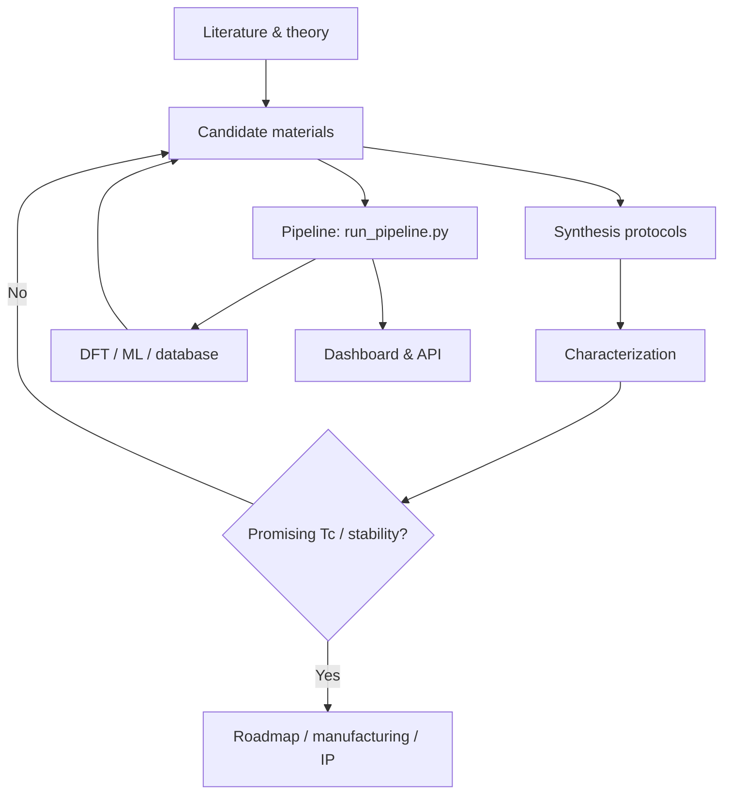

> **AI-Generated Research Scaffold** — This repository was autonomously generated by 4 **DeepSeek V4 Flash** agents operating in **Council Swarm** mode via [Ollama Swarm](https://github.com/kevinkicho/ollama_swarm) ([commit f586caf](https://github.com/kevinkicho/ollama_swarm/commit/f586caf8cde4f544c89c4aea032dc14adba82caa)). The code and documents are a starting scaffold for room-temperature superconductor discovery and are **not validated scientific output**.
>
> **Author**: DeepSeek V4 Flash · **Co-Author**: Kevin Kihyun Cho ([kevinkicho@gmail.com](mailto:kevinkicho@gmail.com))
>
> **License**: [MIT](LICENSE)

# Room-Temperature Superconductor Discovery Scaffold

Research and software scaffold for **room-temperature superconductivity**: literature synthesis, theoretical framing, candidate materials, synthesis/characterization protocols, a Python discovery pipeline, DFT helpers, FastAPI endpoints, and a Streamlit dashboard.

---

## Quick start

```bash
# Python 3.10+ recommended
pip install -r requirements.txt

# Run unit tests
pytest tests/

# Query / explore the materials database
python scripts/query_database.py

# Predict Tc for materials in the database
python scripts/predict_tc.py

# Generate candidate materials
python scripts/generate_candidates.py

# Full pipeline (root orchestrator)
python run_pipeline.py --help

# Streamlit dashboard
streamlit run streamlit_dashboard.py

# Optional FastAPI surface
uvicorn app:app --reload --port 8000
```

**Reproducibility package** (Docker / Conda):

```bash
cd reproducibility
make setup        # conda env from environment.yml
make test
make docker-build
make docker-run
```

See [reproducibility/Makefile](reproducibility/Makefile), [reproducibility/Dockerfile](reproducibility/Dockerfile), and [reproducibility/environment.yml](reproducibility/environment.yml).

---

## Repository layout

| Path | Description |
|------|-------------|
| [`run_pipeline.py`](run_pipeline.py) | Main discovery pipeline orchestrator |
| [`app.py`](app.py) | FastAPI app (candidates, batch predict, submit) |
| [`streamlit_dashboard.py`](streamlit_dashboard.py) | Interactive dashboard |
| [`dft_calculator.py`](dft_calculator.py) | Quantum ESPRESSO / e–ph helpers |
| [`scripts/`](scripts/) | Pipeline modules (query, candidates, Tc, arXiv, API client, reports) |
| [`data/superconductor_database.json`](data/superconductor_database.json) | Curated materials DB (~199 unique entries) |
| [`data/`](data/) | Experimental results, model logs, related JSON |
| [`tests/`](tests/) | Pytest suite |
| [`docs/`](docs/) | Research docs, protocols, plans, guides |
| [`candidate_materials.md`](candidate_materials.md) | Working candidate table (pipeline I/O) |
| [`discovery_strategy.md`](discovery_strategy.md) | Discovery strategy & decision support |
| [`roadmap.md`](roadmap.md) | Project roadmap & milestones |
| [`reproducibility/`](reproducibility/) | Docker, Conda env, Makefile, DB snapshot |
| [`requirements.txt`](requirements.txt) | Python dependencies |
| [`logs/`](logs/) | Runtime/session logs (gitignored) |

---

## Software modules

| Module | Role |
|--------|------|
| [`scripts/query_database.py`](scripts/query_database.py) | Search / filter `data/superconductor_database.json` |
| [`scripts/generate_candidates.py`](scripts/generate_candidates.py) | Candidate generation (including generative/ML paths) |
| [`scripts/predict_tc.py`](scripts/predict_tc.py) | Tc prediction helpers (McMillan / Eliashberg-style and DB lookup) |
| [`scripts/arxiv_scraper.py`](scripts/arxiv_scraper.py) | Literature scraping helpers |
| [`scripts/api_client.py`](scripts/api_client.py) | HTTP client for pipeline / external APIs |
| [`scripts/generate_report.py`](scripts/generate_report.py) | Report generation |
| [`scripts/run_pipeline.py`](scripts/run_pipeline.py) | Alternate / lighter pipeline entry under `scripts/` |
| [`dft_calculator.py`](dft_calculator.py) | DFT / phonon / λ workflow helpers |
| [`app.py`](app.py) | REST API for candidates and predictions |
| [`streamlit_dashboard.py`](streamlit_dashboard.py) | UI for exploration and what-if analysis |

---

## Research documents

### Core research (start here)

| Document | Description |
|----------|-------------|
| [Literature review](docs/literature_review.md) | Survey of room-temperature and high-Tc superconductivity |
| [Theoretical framework](docs/theoretical_framework.md) | BCS, Eliashberg, related models; novel-mechanism notes |
| [Proposed chemistry & physics](docs/proposed_chemistry_physics.md) | Discovery/manufacturing chemistry and physics proposals |
| [Novel mechanism](docs/novel_mechanism.md) | Plasmon-mediated pairing proposal (Dirac semimetal) |
| [Online research summary](docs/online_research_summary.md) | Consolidated web/literature research notes |
| [Candidate materials](candidate_materials.md) | Working list of candidates (properties, Tc, notes) |
| [Discovery strategy](discovery_strategy.md) | Screening, feedback loops, decision support |
| [Roadmap](roadmap.md) | Phased plan and milestones |

### Synthesis, characterization & experiments

| Document | Description |
|----------|-------------|
| [Synthesis methods](docs/synthesis_methods.md) | High-pressure, thin-film, flux, and related protocols |
| [Characterization techniques](docs/characterization_techniques.md) | Resistivity, magnetization, advanced probes |
| [Experimental feedback loop](docs/experimental_feedback_loop.md) | Closed-loop compute → synthesis → characterization |
| [Hydride protocol](docs/experimental_protocol_hydride.md) | Detailed hydride synthesis / characterization |
| [Hydride protocol (JSON)](docs/experimental_protocol_hydride.json) | Machine-readable hydride protocol |
| [New-compound protocol (LaH₁₀-style)](docs/experimental_protocol_new_compound.md) | Extended synthesis protocol for top hydride-class candidates |
| [Carbon-based protocol](docs/experimental_protocol_carbon.md) | Alkali-C₆₀, GIC, boron-doped diamond, etc. |
| [Nickelate protocol](docs/experimental_protocol_nickelate.md) | Infinite-layer nickelate thin-film workflow |

### Manufacturing, IP & commercialization

| Document | Description |
|----------|-------------|
| [Manufacturing scalability](docs/manufacturing_scalability.md) | Cost, yield, scale-up pathways |
| [Challenges & mitigations](docs/challenges_and_mitigations.md) | Metastability, pressure, reproducibility, production readiness |
| [Technology transfer plan](docs/technology_transfer_plan.md) | Commercialization and transfer plan |
| [Process design (top candidate)](docs/process_design_top_candidate.md) | Process flow for carbonaceous sulfur hydride class |
| [Patent draft (top candidate)](docs/patent_draft_top_candidate.md) | Draft patent-style writeup |
| [Grant proposal](docs/grant_proposal.md) | Funding narrative and technical approach |
| [Phase 2 project plan](docs/phase2_project_plan.md) | Pilot-plant style Phase 2 plan |

### Reports & outreach

| Document | Description |
|----------|-------------|
| [Executive summary](docs/executive_summary.md) | High-level status of top candidates and risks |
| [Final report](docs/final_report.md) | Project outcomes summary |
| [Research paper draft](docs/research_paper.md) | Review + proposed discovery/manufacturing pathways |
| [Project closure report](docs/project_closure_report.md) | Closure / TRL-style assessment |
| [Public outreach summary](docs/public_outreach_summary.md) | Press-style public summary |

### Guides

| Document | Description |
|----------|-------------|
| [User manual](docs/user_manual.md) | Installation, configuration, operation of the pipeline |
| [Deployment guide](docs/deployment_guide.md) | Docker / cloud deployment notes |
| [Tutorial notebook](docs/tutorial.ipynb) | Interactive tutorial |
| [Grafana dashboard JSON](docs/grafana_dashboard.json) | Sample Grafana dashboard definition |

### Architecture (research workflow)



---

## Data

| File | Description |
|------|-------------|
| [`data/superconductor_database.json`](data/superconductor_database.json) | Primary materials database (deduplicated by name) |
| [`data/experimental_results.json`](data/experimental_results.json) | Experimental result snapshots |
| [`data/model_performance_log.json`](data/model_performance_log.json) | Model performance log entries |
| [`data/paper_2025_data.json`](data/paper_2025_data.json) | Extracted paper metadata / properties |
| [`data/predictive_maintenance.json`](data/predictive_maintenance.json) | Predictive-maintenance style records |
| [`reproducibility/data/superconductor_database.json`](reproducibility/data/superconductor_database.json) | Smaller DB snapshot for the reproducibility package |

---

## Testing

```bash
pytest tests/
pytest tests/test_predict_tc.py
pytest --cov=scripts --cov=dft_calculator tests/
```

Test modules: `test_api_client`, `test_api_endpoints`, `test_arxiv_scraper`, `test_autonomous_loop`, `test_dft_calculator`, `test_generate_candidates`, `test_generate_report`, `test_predict_tc`, `test_query_database`, `test_run_pipeline`.

---

## Dashboard and API

**Streamlit**

```bash
streamlit run streamlit_dashboard.py
# default: http://localhost:8501
```

**FastAPI**

```bash
uvicorn app:app --reload --port 8000
# interactive docs: http://localhost:8000/docs
```

API requests expect an API key header (see `app.py`; align clients with the header name the server actually checks).

---

## Environment notes

- Core stack: Python, NumPy/SciPy/Pandas, scikit-learn, PyTorch, FastAPI, Streamlit, pymatgen, pytest (see [`requirements.txt`](requirements.txt)).
- Full dependency set is large (optional ML/RL/DFT-related packages). Prefer the [reproducibility](reproducibility/) Conda/Docker path for a controlled environment.
- Runtime logs under `logs/` are gitignored.
- There is **no** root `config.yaml`, `business_plan.md`, or `press_release.md` in this tree; configuration is primarily via CLI flags and environment variables as used by individual scripts.

---

## Contributing

1. Open an issue describing the change.
2. Add or update tests under `tests/` for behavior changes.
3. Run `pytest tests/` before submitting a PR.
4. Prefer updating documents under `docs/` (or the root working files `candidate_materials.md`, `discovery_strategy.md`, `roadmap.md`) rather than duplicating content.

For closed-loop experimental workflow context, see [Experimental feedback loop](docs/experimental_feedback_loop.md).

---

## Disclaimer

This repository is an **AI-generated scaffold**. Predictions, protocols, patent/grant language, and commercialization plans are exploratory and must be independently reviewed by qualified researchers before any experimental or commercial use. High-pressure hydride and related claims in the literature remain subject to reproducibility constraints.
