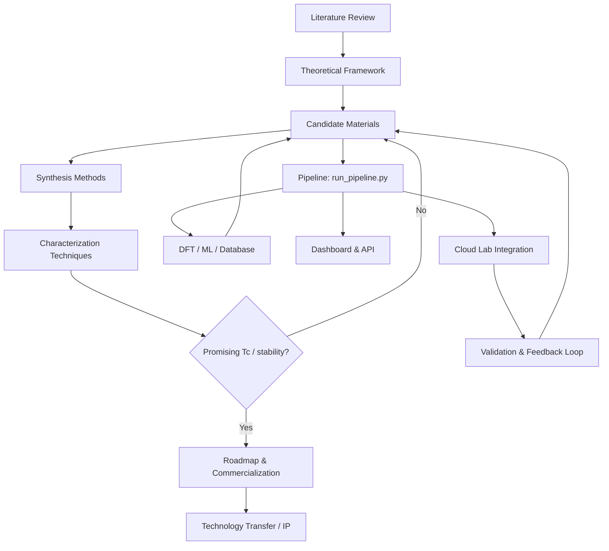

> **AI-Generated Research Scaffold** — This repository was autonomously generated by 4 **DeepSeek V4 Flash** agents operating in **Council Swarm** mode via [Ollama Swarm](https://github.com/kevinkicho/ollama_swarm) ([commit f586caf](https://github.com/kevinkicho/ollama_swarm/commit/f586caf8cde4f544c89c4aea032dc14adba82caa)). The code is a starting scaffold for room-temperature superconductor discovery and is **not validated scientific output**.
>
> **Author**: DeepSeek V4 Flash · **Co-Author**: Kevin Kihyun Cho ([kevinkicho@gmail.com](mailto:kevinkicho@gmail.com))
>
> **License**: [MIT](LICENSE)

# Room-Temperature Superconductivity — Project Overview

This repository documents a research project on **room-temperature superconductivity**: literature and theory, candidate materials, synthesis and characterization protocols, manufacturing and commercialization plans, plus a Python discovery pipeline (orchestration, DFT helpers, FastAPI surface, and Streamlit dashboard).

It is an **AI-generated scaffold**. Treat predictions, protocols, and business language as exploratory starting points — not experimental truth.

---

## Table of contents

1. [Key documents](#key-documents)
2. [Navigation](#navigation)
3. [Architecture](#architecture)
4. [Repository layout](#repository-layout)
5. [User manual](#user-manual)
6. [Quickstart tutorial](#quickstart-tutorial)
7. [Testing](#testing)
8. [Dashboard and API](#dashboard-and-api)
9. [Cloud lab integration](#cloud-lab-integration)
10. [Reproducibility](#reproducibility)
11. [Chemistry and physics summary](#chemistry-and-physics-of-room-temperature-superconductivity)
12. [Funding and grant materials](#funding-and-grant-materials)
13. [Access control (scaffold)](#user-management-and-role-based-access-control-rbac)
14. [All documents (catalog)](#all-documents)
15. [Changelog](#changelog)
16. [How to contribute](#how-to-contribute)
17. [Disclaimer](#disclaimer)

---

## Key documents

Start here for the research narrative:

| Document | Description |
|----------|-------------|
| [Literature review](docs/literature_review.md) | Survey of room-temperature and high-Tc superconductivity research |
| [Theoretical framework](docs/theoretical_framework.md) | BCS, Eliashberg, and related models guiding the work |
| [Candidate materials](candidate_materials.md) | Working table of candidates (pipeline I/O at repo root) |
| [Synthesis methods](docs/synthesis_methods.md) | High-pressure, thin-film, flux, and related protocols |
| [Characterization techniques](docs/characterization_techniques.md) | Resistivity, magnetization, and advanced probes |
| [Roadmap](roadmap.md) | Phased plan, milestones, and validation path (repo root) |
| [Proposed chemistry & physics](docs/proposed_chemistry_physics.md) | Chemistry/physics proposals for discovery and manufacturing |
| [Technology transfer plan](docs/technology_transfer_plan.md) | Commercialization and transfer planning |
| [Discovery strategy](discovery_strategy.md) | Screening strategy and decision support (repo root) |
| [Online research summary](docs/online_research_summary.md) | Consolidated literature / web research notes |
| [Manufacturing scalability](docs/manufacturing_scalability.md) | Cost, yield, and scale-up analysis |
| [Experimental feedback loop](docs/experimental_feedback_loop.md) | Closed-loop compute → synthesis → characterization |
| [Novel mechanism](docs/novel_mechanism.md) | Plasmon-mediated pairing proposal |
| [Challenges & mitigations](docs/challenges_and_mitigations.md) | Metastability, pressure, reproducibility, production readiness |

Also useful: [Executive summary](docs/executive_summary.md) · [Final report](docs/final_report.md) · [Research paper draft](docs/research_paper.md) · [Public outreach summary](docs/public_outreach_summary.md) · [Grant proposal](docs/grant_proposal.md)

---

## Navigation

**Suggested reading order**

1. [Literature review](docs/literature_review.md) — state of the field  
2. [Theoretical framework](docs/theoretical_framework.md) and [proposed chemistry & physics](docs/proposed_chemistry_physics.md)  
3. [Candidate materials](candidate_materials.md) and [discovery strategy](discovery_strategy.md)  
4. [Synthesis methods](docs/synthesis_methods.md) and [characterization techniques](docs/characterization_techniques.md)  
5. Experimental protocols (hydride, nickelate, carbon — see [catalog](#all-documents))  
6. [Roadmap](roadmap.md), [manufacturing scalability](docs/manufacturing_scalability.md), [technology transfer](docs/technology_transfer_plan.md)  
7. Software: [user manual](docs/user_manual.md), pipeline, dashboard  

**Software entry points**

| Goal | Command / path |
|------|----------------|
| Install deps | `pip install -r requirements.txt` |
| Run tests | `pytest tests/` |
| Query materials DB | `python scripts/query_database.py` |
| Predict Tc | `python scripts/predict_tc.py` |
| Generate candidates | `python scripts/generate_candidates.py` |
| Full pipeline | `python run_pipeline.py --help` |
| Streamlit UI | `streamlit run streamlit_dashboard.py` |
| FastAPI | `uvicorn app:app --reload --port 8000` |
| Reproducibility package | `cd reproducibility && make setup` |

---

## Architecture



### Module descriptions

| Module | Role |
|--------|------|
| **Literature & theory** | Field survey, BCS/Eliashberg framing, novel-mechanism notes |
| **Candidate materials** | Prioritized compounds with Tc, pressure, structure, references |
| **Synthesis & characterization** | Lab-oriented protocols and measurement methods |
| **Pipeline (`run_pipeline.py`)** | Orchestrates query → generate → predict → optional simulation loops |
| **Scripts (`scripts/`)** | Database query, candidate generation, Tc prediction, arXiv scrape, reports, API client |
| **DFT (`dft_calculator.py`)** | Quantum ESPRESSO / electron–phonon helper workflows |
| **API (`app.py`)** | FastAPI endpoints for candidates and batch prediction |
| **Dashboard (`streamlit_dashboard.py`)** | Interactive exploration and what-if style views |
| **Cloud lab / feedback loop** | Documented closed-loop workflow (see experimental feedback loop) |
| **Manufacturing & transfer** | Scalability, challenges, patent draft, grant narrative |

---

## Repository layout

```
.
├── README.md                 # This file
├── LICENSE
├── requirements.txt
├── candidate_materials.md    # Working candidate table (pipeline I/O)
├── discovery_strategy.md
├── roadmap.md
├── run_pipeline.py           # Main pipeline orchestrator
├── app.py                    # FastAPI surface
├── streamlit_dashboard.py
├── dft_calculator.py
├── scripts/
│   ├── query_database.py
│   ├── generate_candidates.py
│   ├── predict_tc.py
│   ├── arxiv_scraper.py
│   ├── api_client.py
│   ├── generate_report.py
│   └── run_pipeline.py       # Alternate / lighter pipeline entry
├── data/
│   ├── superconductor_database.json   # ~199 unique materials (deduplicated)
│   ├── experimental_results.json
│   ├── model_performance_log.json
│   ├── paper_2025_data.json
│   └── predictive_maintenance.json
├── docs/                     # Research docs, protocols, plans, guides
├── tests/                    # Pytest suite
├── reproducibility/          # Docker, Conda, Makefile, DB snapshot
└── logs/                     # Runtime logs (gitignored)
```

---

## User manual

For a longer guide, see the full [User manual](docs/user_manual.md) and [Deployment guide](docs/deployment_guide.md).

### Installation

Python **3.10+** recommended (3.8+ may work for lighter scripts).

```bash
git clone https://github.com/kevinkicho/superconducters.git
cd superconducters
pip install -r requirements.txt
```

`requirements.txt` pulls a **large** stack (NumPy, SciPy, pandas, scikit-learn, PyTorch, FastAPI, Streamlit, pymatgen, pytest, and more). For a controlled environment, prefer the [reproducibility package](#reproducibility).

Core-only (minimal exploration, not full pipeline):

```bash
pip install numpy scipy matplotlib pandas scikit-learn pytest
```

### Configuration

There is **no** checked-in `config.yaml`. Configuration is primarily via:

- **CLI flags** on `run_pipeline.py` and scripts (`python run_pipeline.py --help`)
- **Environment variables**, for example:
  - `DATA_DIR` — input data directory (default concept: `data/`)
  - `OUTPUT_DIR` — reports/output directory (default concept: `output/`)
  - `CLOUD_LAB_API_KEY` / `CLOUD_LAB_ENDPOINT` or `CLOUD_LAB_API_URL` — cloud lab integration
  - `SLACK_WEBHOOK_URL` / `SLACK_CHANNEL` — optional Slack alerts
  - API key headers expected by `app.py` (see source; align clients carefully)

### Running the pipeline

**Root orchestrator** (primary):

```bash
python run_pipeline.py --help
python run_pipeline.py
```

**Scripts package** (query / candidates / predict pieces):

```bash
python scripts/query_database.py
python scripts/generate_candidates.py
python scripts/predict_tc.py
python scripts/run_pipeline.py
```

Typical flow when the orchestrator is healthy:

1. Load materials from [`data/superconductor_database.json`](data/superconductor_database.json) and/or [`candidate_materials.md`](candidate_materials.md)
2. Generate or rank candidates
3. Predict Tc and related metrics
4. Optionally run simulation, active learning, multi-fidelity, or feedback-loop flags
5. Update markdown/JSON outputs under the project tree and any configured `output/` directory

### Interpreting results

After a run, inspect:

| Artifact | What to look for |
|----------|------------------|
| [`candidate_materials.md`](candidate_materials.md) | Ranked candidates, predicted Tc, synthesis notes |
| [`roadmap.md`](roadmap.md) | Milestones and validation plan updates |
| [`data/superconductor_database.json`](data/superconductor_database.json) | Structured material records |
| [`data/model_performance_log.json`](data/model_performance_log.json) | Model performance entries |
| [`data/experimental_results.json`](data/experimental_results.json) | Experimental snapshots |
| `output/` (if created) | Logs, plots, audit-style exports from a given run |

**Key metrics (conceptual)**

- **Predicted Tc** — critical temperature estimate (K)
- **Pressure** — often high-GPa for hydrides
- **Validation / confidence** — when populated by pipeline or cloud-lab paths
- **Yield / cost** — manufacturing simulation quantities (when those modules run)

### Examples

**Example 1 — help and basic pipeline**

```bash
python run_pipeline.py --help
python run_pipeline.py
```

**Example 2 — dashboard**

```bash
streamlit run streamlit_dashboard.py
# open http://localhost:8501
```

**Example 3 — API**

```bash
uvicorn app:app --reload --port 8000
# OpenAPI UI: http://localhost:8000/docs
```

### Troubleshooting

| Symptom | What to try |
|---------|-------------|
| `ModuleNotFoundError` | `pip install -r requirements.txt` or use `reproducibility/` Conda/Docker |
| `FileNotFoundError` for candidates | Ensure [`candidate_materials.md`](candidate_materials.md) exists at repo root |
| Heavy install fails | Install core scientific stack first; defer torch/optional extras |
| API 401 | Provide the API key header expected by [`app.py`](app.py) |
| Pipeline `NameError` / incomplete paths | Scaffold is known to be incomplete in places; prefer scripts and tests as entry points |
| Encoding issues on Windows | Prefer UTF-8 terminal / `PYTHONUTF8=1` |

For closed-loop experimental context, see [Experimental feedback loop](docs/experimental_feedback_loop.md).

---

## Quickstart tutorial

End-to-end walkthrough for a first discovery-style run.

### Step 1: Install dependencies

```bash
pip install -r requirements.txt
```

### Step 2: Explore the database

```bash
python scripts/query_database.py
```

Browse [`data/superconductor_database.json`](data/superconductor_database.json) and [`candidate_materials.md`](candidate_materials.md).

### Step 3: Predict / generate

```bash
python scripts/predict_tc.py
python scripts/generate_candidates.py
```

### Step 4: Run orchestrator (optional)

```bash
python run_pipeline.py
```

### Step 5: Visualize

```bash
streamlit run streamlit_dashboard.py
```

### Step 6: Read the science narrative

- [Final report](docs/final_report.md)
- [Executive summary](docs/executive_summary.md)
- [Research paper draft](docs/research_paper.md)

**Illustrative log (example only — not a live guarantee):**

```
[INFO] Loading candidate: YBa2Cu3O7
[INFO] Predicting Tc...
[INFO] Predicted Tc: 92 K
[INFO] Validation score: 0.87
[INFO] Audit trail written
```

Interpretation:

- **Predicted Tc** above 77 K is interesting for LN2-cooled applications; room temperature is ~300 K and much harder.
- Treat all scaffold numbers as **unvalidated**.

---

## Testing

Unit tests live under [`tests/`](tests/).

```bash
pytest tests/
pytest tests/test_predict_tc.py
pytest --cov=scripts --cov=dft_calculator tests/
```

| Test module | Focus |
|-------------|--------|
| `test_query_database.py` | Database query helpers |
| `test_predict_tc.py` | Tc prediction utilities |
| `test_generate_candidates.py` | Candidate generation |
| `test_generate_report.py` | Reporting |
| `test_arxiv_scraper.py` | Literature scrape helpers |
| `test_api_client.py` | HTTP client |
| `test_api_endpoints.py` | API surface |
| `test_dft_calculator.py` | DFT helpers |
| `test_run_pipeline.py` | Pipeline orchestration |
| `test_autonomous_loop.py` | Autonomous loop behavior |

---

## Dashboard and API

### Streamlit dashboard

```bash
pip install streamlit requests pandas   # if not already installed via requirements
streamlit run streamlit_dashboard.py
```

- Default UI: `http://localhost:8501`
- Optional env: `CLOUD_LAB_API_URL`, `CLOUD_LAB_API_KEY`
- The dashboard may expose overview / materials / what-if style tabs depending on the current `streamlit_dashboard.py` build

### FastAPI

```bash
uvicorn app:app --reload --port 8000
```

- Interactive docs: `http://localhost:8000/docs`
- Endpoints include candidate list/create and batch prediction (see [`app.py`](app.py))
- Authenticate with the API key header the server expects

### Optional deployment notes

The scaffold mentions container/cloud deploy patterns; a practical path is:

1. Use [`reproducibility/Dockerfile`](reproducibility/Dockerfile) as the image base  
2. Or deploy Streamlit with your host of choice (`streamlit run streamlit_dashboard.py --server.port $PORT`)  
3. See [Deployment guide](docs/deployment_guide.md) for broader cloud notes  

There is **no** guaranteed Heroku/GitHub Actions CI setup in this repo (CI is intentionally not configured for this scaffold).

---

## Cloud lab integration

Documented integration path for automated synthesis / characterization partners:

1. Set `CLOUD_LAB_API_KEY` and endpoint URL (`CLOUD_LAB_ENDPOINT` or `CLOUD_LAB_API_URL`, depending on the script path you use)
2. Run pipeline flags related to cloud lab / feedback loop when available (`python run_pipeline.py --help`)
3. Review results in data files and [candidate materials](candidate_materials.md)
4. Follow the detailed workflow in [Experimental feedback loop](docs/experimental_feedback_loop.md) (including any cloud-lab subsections)

Validated experimental outcomes should be recorded with clear provenance (who measured, conditions, DOI/reference).

### Alerts (optional)

Pipeline code paths may support Slack-style notifications:

1. Create a Slack Incoming Webhook  
2. Set `SLACK_WEBHOOK_URL` (and optionally `SLACK_CHANNEL`)  
3. Run pipeline alert/test flags if present in `--help`  

Example **local** alert rule file you can create yourself (not shipped):

```yaml
# config/alerts.yaml  (create if you want this pattern)
alerts:
  - name: synthesis_failure
    condition: "synthesis_status == 'failed'"
    channels: [email, slack]
    recipients: ["team@example.com"]
```

### Data export formats

When export flags are supported, common targets include:

| Format | Use |
|--------|-----|
| CSV | Spreadsheets, quick analysis |
| JSON | Programmatic consumers |
| Parquet | Large columnar datasets |
| Excel | Multi-sheet human review |

Example pattern: `python run_pipeline.py --export-format csv` (confirm flags via `--help`). Exports typically land under an `exports/` or `output/` directory when generated.

---

## Reproducibility

A dedicated package lives in [`reproducibility/`](reproducibility/):

| File | Purpose |
|------|---------|
| [Dockerfile](reproducibility/Dockerfile) | Container with scientific stack |
| [environment.yml](reproducibility/environment.yml) | Conda environment |
| [Makefile](reproducibility/Makefile) | `setup`, `run`, `test`, `docker-build`, `docker-run`, `clean` |
| [data/superconductor_database.json](reproducibility/data/superconductor_database.json) | Snapshot DB for package |

### Option 1: Docker

```bash
cd reproducibility
make docker-build
make docker-run
```

### Option 2: Conda + Makefile

```bash
cd reproducibility
make setup
conda activate superconductor   # name may match environment.yml
make run
make test
```

### Option 3: Manual Conda

```bash
conda env create -f reproducibility/environment.yml
conda activate superconductor
python run_pipeline.py --help
pytest tests/
```

---

## Chemistry and physics of room-temperature superconductivity

Based on the literature survey and research notes in this repo (see also [proposed chemistry & physics](docs/proposed_chemistry_physics.md) and [online research summary](docs/online_research_summary.md)):

### Key physics principles

- **BCS theory** — Electron–phonon pairing; high Tc favors strong coupling and high phonon frequencies (light elements: H, B, C, N).
- **Eliashberg equations** — Strong-coupling refinement used for first-principles Tc estimates.
- **High-pressure stabilization** — Many hydrides (e.g. H₃S, LaH₁₀) need >100 GPa to stabilize metallic hydrogen sublattices.
- **Superconducting dome** — Tc often peaks at an optimal pressure/doping; beyond that, structure changes or decomposition hurt Tc.

### Key chemistry principles

- **Hydride superconductors** — H₃S (~203 K), LaH₁₀ (~250 K under ~170 GPa), YH₆, ThH₁₀, etc.
- **Carbonaceous sulfur hydride (C–S–H)** — High-Tc claims under extreme pressure remain controversial; independent verification is essential.
- **Clathrate / ternary hydrides** — e.g. Li–Mg–H systems proposed for high Tc at somewhat lower pressures.
- **Doping and alloying** — Tune electronic structure and chemical pressure (treat retracted claims carefully).
- **Metallic hydrogen** — Long-standing theoretical RTSC candidate at extreme pressure; synthesis remains extremely hard.

### Manufacturing approaches

- Diamond anvil cell (DAC) and laser-heated DAC for microgram-scale high-P synthesis  
- Multi-anvil presses for lower-P, larger volume  
- Cryogenic H₂ loading, in-situ XRD/Raman/transport under pressure  

### Open challenges

- Reproducibility of headline claims  
- Extreme pressure requirements for best hydrides  
- Metastability on decompression  
- Scale-up beyond DAC sample sizes  

### Selected references

- Drozdov et al., *Nature* 525, 73–76 (2015) — H₃S, Tc ≈ 203 K at ~155 GPa  
- Somayazulu et al., *Phys. Rev. Lett.* 122, 027001 (2019) — LaH₁₀, Tc ≈ 250 K  
- Snider et al., *Nature* 586, 373–377 (2020) — C–S–H claim (controversial)  
- Peng et al., *Phys. Rev. Lett.* 119, 107001 (2017) — Li₂MgH₁₆-type predictions  
- Zurek & Bi, *J. Chem. Phys.* 150, 050901 (2019) — hydride review  

Deeper writeups: [theoretical framework](docs/theoretical_framework.md), [novel mechanism](docs/novel_mechanism.md), [challenges & mitigations](docs/challenges_and_mitigations.md).

---

## Funding and grant materials

### In-repo materials

- [Grant proposal](docs/grant_proposal.md) — narrative technical approach and broader impacts  
- [Phase 2 project plan](docs/phase2_project_plan.md) — pilot-plant style planning  
- [Technology transfer plan](docs/technology_transfer_plan.md) — commercialization path  
- [Patent draft (top candidate)](docs/patent_draft_top_candidate.md) — draft IP language  
- [Process design (top candidate)](docs/process_design_top_candidate.md) — process flow notes  
- [Manufacturing scalability](docs/manufacturing_scalability.md) — cost/yield framing  

### External funding programs (pointers only)

| Program | Notes |
|---------|--------|
| [DOE SBIR/STTR](https://science.osti.gov/sbir) | Phase I/II; materials & energy themes |
| [NSF SBIR/STTR](https://www.nsf.gov/funding/sequential-funding/sbir) | Translational research with scientific merit |
| [ARPA-E](https://arpa-e.energy.gov/) | High-risk energy technologies; program-specific calls |

Always verify current deadlines and solicitations on the agency sites.

---

## User management and role-based access control (RBAC)

The scaffold describes optional RBAC for multi-user deployments. Treat this as **design documentation** unless you wire it into a real auth stack.

**Roles (conceptual)**

| Role | Intended access |
|------|-----------------|
| `admin` | Full pipeline, config, user management |
| `researcher` | Experiments, candidates, methods; limited config |
| `viewer` | Read-only reports and summaries |

**Example environment variables**

```bash
export RBAC_ROLE=researcher
export RBAC_RESEARCHER_API_KEY=your_researcher_key_here

# or
export RBAC_ROLE=admin
export RBAC_ADMIN_API_KEY=your_admin_key_here
```

### OAuth2 provider configuration (optional scaffold)

If you enable OAuth2 frontends later:

**Google**

1. Create credentials in [Google Cloud Console](https://console.cloud.google.com/)  
2. Set redirect URI (e.g. `http://localhost:8000/auth/google/callback`)  
3. Set `OAUTH2_GOOGLE_CLIENT_ID`, `OAUTH2_GOOGLE_CLIENT_SECRET`, `OAUTH2_GOOGLE_REDIRECT_URI`  

**GitHub**

1. Register an OAuth App under [GitHub Developer Settings](https://github.com/settings/developers)  
2. Set callback URL  
3. Set `OAUTH2_GITHUB_CLIENT_ID`, `OAUTH2_GITHUB_CLIENT_SECRET`, `OAUTH2_GITHUB_REDIRECT_URI`  

**Role mapping example**

```bash
export OAUTH2_ROLE_MAPPING='{"@admin.org":"admin","@research.org":"researcher"}'
```

If OAuth2 is not configured, fall back to env-based RBAC or open local use for development.

---

## Audit trail and version control notes

When the pipeline writes audit-style artifacts, look under `output/` (if created) for logs and JSON summaries. Example inspection:

```bash
# if generated
cat output/audit.json | jq .
```

The project itself is versioned with Git. Optional post-run commit hook pattern:

```bash
#!/bin/bash
git add -A
git commit -m "Auto-commit: pipeline run $(date +%Y-%m-%d_%H:%M:%S)"
# push only if you intend remote updates
```

This repository intentionally has **no** GitHub Actions workflows (see [`.github/README.md`](.github/README.md)). Do not expect CI builds on push.

---

## All documents

### Research framework

- [Literature review](docs/literature_review.md) — extended field survey  
- [Theoretical framework](docs/theoretical_framework.md) — models and frameworks  
- [Proposed chemistry & physics](docs/proposed_chemistry_physics.md) — discovery/manufacturing chemistry  
- [Novel mechanism](docs/novel_mechanism.md) — plasmon-mediated pairing writeup  
- [Online research summary](docs/online_research_summary.md) — consolidated research notes  
- [Candidate materials](candidate_materials.md) — working candidate table (root)  
- [Discovery strategy](discovery_strategy.md) — strategy and decision support (root)  
- [Roadmap](roadmap.md) — milestones and plan (root)  
- [Synthesis methods](docs/synthesis_methods.md)  
- [Characterization techniques](docs/characterization_techniques.md)  

### Experimental protocols

- [Hydride superconductors](docs/experimental_protocol_hydride.md)  
- [Hydride protocol (JSON)](docs/experimental_protocol_hydride.json)  
- [New-compound / LaH₁₀-style protocol](docs/experimental_protocol_new_compound.md)  
- [Carbon-based superconductors](docs/experimental_protocol_carbon.md)  
- [Nickelate superconductors](docs/experimental_protocol_nickelate.md)  
- [Experimental feedback loop](docs/experimental_feedback_loop.md)  

### Project management & reports

- [Phase 2 project plan](docs/phase2_project_plan.md)  
- [Project closure report](docs/project_closure_report.md)  
- [Executive summary](docs/executive_summary.md)  
- [Final report](docs/final_report.md)  
- [Research paper draft](docs/research_paper.md)  
- [Public outreach summary](docs/public_outreach_summary.md)  

### Commercialization & IP

- [Patent draft (top candidate)](docs/patent_draft_top_candidate.md)  
- [Process design (top candidate)](docs/process_design_top_candidate.md)  
- [Technology transfer plan](docs/technology_transfer_plan.md)  
- [Manufacturing scalability](docs/manufacturing_scalability.md)  
- [Challenges and mitigations](docs/challenges_and_mitigations.md)  
- [Grant proposal](docs/grant_proposal.md)  

### Operations, software & data

- [User manual](docs/user_manual.md)  
- [Deployment guide](docs/deployment_guide.md)  
- [Tutorial notebook](docs/tutorial.ipynb)  
- [Grafana dashboard JSON](docs/grafana_dashboard.json)  
- [Static docs index](docs/_site/index.html)  
- [Superconductor database](data/superconductor_database.json)  
- [Experimental results](data/experimental_results.json)  
- [Model performance log](data/model_performance_log.json)  
- [Paper 2025 data](data/paper_2025_data.json)  

### Software source (primary)

- [`run_pipeline.py`](run_pipeline.py) · [`app.py`](app.py) · [`streamlit_dashboard.py`](streamlit_dashboard.py) · [`dft_calculator.py`](dft_calculator.py)  
- [`scripts/`](scripts/) · [`tests/`](tests/) · [`reproducibility/`](reproducibility/) · [`requirements.txt`](requirements.txt)  

---

## Changelog

Agent and maintainer activity is logged in a **paginated** changelog (newest first), with LOC deltas and expanders for long text:

- Hub + agent regen instructions: [`CHANGELOG.md`](CHANGELOG.md)
- Page index: [`changelog/README.md`](changelog/README.md)
- Regenerate after new work: `python scripts/generate_changelog.py`

## How to contribute

1. Open an issue describing the idea or bug.  
2. Prefer updating canonical docs under `docs/` (or root working files: `candidate_materials.md`, `discovery_strategy.md`, `roadmap.md`) rather than duplicating content.  
3. Add or update tests under `tests/` for behavior changes.  
4. Run `pytest tests/` before opening a PR.  
5. Keep the scaffold disclaimer intact: do not present unvalidated results as measured science.  

Workflow context: [Experimental feedback loop](docs/experimental_feedback_loop.md).

---

## Disclaimer

This repository is an **AI-generated research scaffold**. Predictions, experimental protocols, patent/grant language, commercialization plans, and pipeline outputs are **exploratory**. They must be independently reviewed by qualified researchers before any laboratory work, publication claim, or commercial use. High-pressure hydride and related literature claims remain subject to reproducibility constraints.

**Not runnable as a production scientific platform.** Prefer reading the documents, exploring the database, and treating code as incomplete prototype glue — not a turnkey discovery system.
