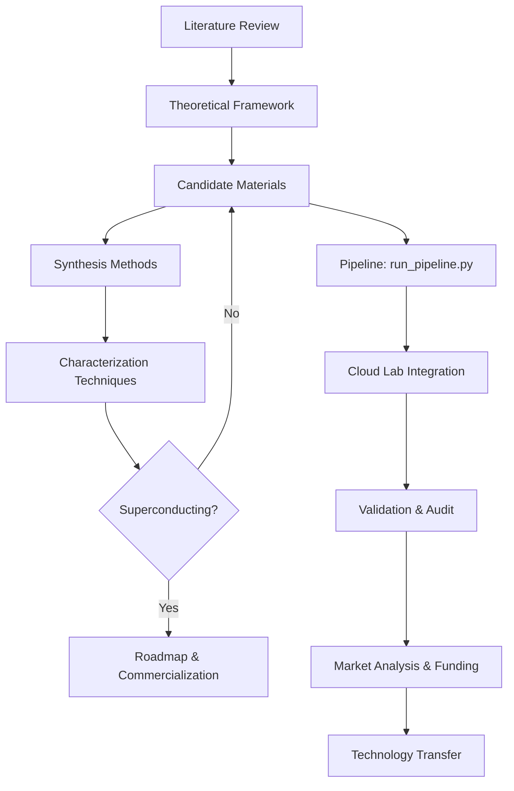

> **AI-Generated Research Scaffold** — This repository was autonomously generated by 4 **DeepSeek V4 Flash** agents operating in **Council Swarm** mode via [Ollama Swarm](https://github.com/kevinkicho/ollama_swarm) ([commit f586caf](https://github.com/kevinkicho/ollama_swarm/commit/f586caf8cde4f544c89c4aea032dc14adba82caa)). The code is a starting scaffold for room-temperature superconductor discovery and is not validated scientific output.
>
> **Author**: DeepSeek V4 Flash · **Co-Author**: Kevin Kihyun Cho ([kevinkicho@gmail.com](mailto:kevinkicho@gmail.com))

# Project Overview

This repository documents a research project on room-temperature superconductivity. It includes the following key documents:

- [literature_review.md](literature_review.md): Comprehensive review of existing literature on room-temperature superconductivity.
- [theoretical_framework.md](theoretical_framework.md): Theoretical models and frameworks guiding the research.
- [candidate_materials.md](candidate_materials.md): List and properties of candidate materials for room-temperature superconductivity.
- [synthesis_methods.md](synthesis_methods.md): Methods and procedures for synthesizing candidate materials.
- [characterization_techniques.md](characterization_techniques.md): Techniques used to characterize superconducting properties.
- [roadmap.md](roadmap.md): Project roadmap and future milestones.
- [proposed_chemistry_physics.md](proposed_chemistry_physics.md): Proposed chemistry and physics for discovering and manufacturing room-temperature superconducting compounds.
- [slide_deck.md](docs/slide_deck.md): Generated slide deck summarizing the research.
- [technology_transfer_plan.md](docs/technology_transfer_plan.md): Technology transfer plan for commercializing room-temperature superconductors.

## Navigation

Start with the literature review to understand the current state of research, then explore the theoretical framework. Next, review candidate materials and synthesis methods. The characterization techniques document explains how we verify superconductivity, and the roadmap outlines next steps.

Additionally, see the following key documents: [discovery_strategy.md](discovery_strategy.md), [online_research_summary.md](docs/online_research_summary.md), [manufacturing_scalability.md](docs/manufacturing_scalability.md), [experimental_protocol_hydride.md](docs/experimental_protocol_hydride.md), [novel_mechanism.md](docs/novel_mechanism.md), [weekly_digest.md](docs/weekly_digest.md), [project_health_report.md](docs/project_health_report.md), [Production Readiness](docs/challenges_and_mitigations.md#production-readiness), and [project_closure_report.md](docs/project_closure_report.md).


## Architecture



### Module Descriptions

- **Literature Review**: Comprehensive survey of existing research on room-temperature superconductivity, including key papers and findings.
- **Theoretical Framework**: Theoretical models (e.g., BCS theory, Eliashberg equations) used to predict and explain superconducting behavior.
- **Candidate Materials**: Database of potential superconducting compounds with properties and predicted Tc values.
- **Synthesis Methods**: Protocols for synthesizing candidate materials, including high-pressure synthesis and doping techniques.
- **Characterization Techniques**: Methods for measuring Tc, critical current, and other superconducting properties (e.g., resistivity, magnetization).
- **Pipeline (run_pipeline.py)**: Automated workflow that evaluates candidates, runs simulations, and generates reports.
- **Cloud Lab Integration**: Automated submission of candidates to cloud-based synthesis and testing facilities.
- **Validation & Audit**: Tracking of all pipeline runs with audit trails and validation scores.
- **Market Analysis**: Economic analysis of potential markets, competitive landscape, and funding strategies.
- **Technology Transfer**: Plan for commercializing successful superconductors, including IP and manufacturing scalability.

## Testing

Unit tests are located in the `tests/` directory. To run all tests, use:
```
pytest tests/
```
To run a specific test file, e.g., `test_predict_tc.py`:
```
pytest tests/test_predict_tc.py
```
Ensure you have the required dependencies installed. For test coverage, you can use `pytest --cov=scripts tests/`. See the [experimental feedback loop guide](docs/experimental_feedback_loop.md) for more details.

## How to Contribute

We welcome contributions! To propose changes, please open an issue describing your idea before submitting a pull request. Report bugs by creating a detailed issue with steps to reproduce. When submitting a pull request, ensure your code follows the project's style and includes relevant tests. All new features must include unit tests in the `tests/` directory. Run the full test suite before submitting to ensure nothing is broken. For more information, see our [experimental feedback loop guide](docs/experimental_feedback_loop.md).


## User Manual

### Installation

Ensure you have Python 3.8+ installed. Clone the repository and install required packages:

```
pip install -r requirements.txt
```

If you do not have a `requirements.txt`, install the core dependencies manually:

```
pip install numpy scipy matplotlib pandas scikit-learn pytest
```

### Configuration

The pipeline uses a configuration file `config.yaml` (if present) or environment variables. Key settings include:

- `DATA_DIR`: Directory for input data (default: `data/`)
- `OUTPUT_DIR`: Directory for output reports (default: `output/`)
- `MAX_CANDIDATES`: Maximum number of candidates to evaluate (default: 10)

You can override these by setting environment variables or editing `config.yaml`.

### Running the Pipeline

Execute the main pipeline script:

```
python scripts/run_pipeline.py
```

This will:

1. Load candidate materials from `candidate_materials.md` (or a database).
2. Run simulations (Monte Carlo for manufacturing, active learning for discovery).
3. Generate updated reports in `candidate_materials.md`, `roadmap.md`, and other output files.

To run a specific candidate, use:

```
python scripts/run_pipeline.py --candidate "YH3"
```

### Interpreting Results

After running the pipeline, check the following files:

- `candidate_materials.md`: Updated list of candidates with predicted Tc, synthesis parameters, and sensitivity analysis.
- `roadmap.md`: Updated project roadmap with milestones and validation plan.
- `output/`: Contains log files, plots (e.g., `sensitivity_top_candidate.png`), and simulation results.

Key metrics to look for:

- **Predicted Tc**: The critical temperature from the PINN model.
- **Yield**: Manufacturing yield from Monte Carlo simulation.
- **Cost**: Estimated cost per gram.

### Examples

**Example 1: Basic run**

```
python scripts/run_pipeline.py
```

Expected output: Console logs showing progress, and updated markdown files.

**Example 2: Run with custom configuration**

```
CONFIG_PATH=my_config.yaml python scripts/run_pipeline.py
```

### Troubleshooting

- **ModuleNotFoundError**: Ensure all dependencies are installed. Run `pip install -r requirements.txt`.
- **FileNotFoundError**: Check that `candidate_materials.md` exists in the project root. If not, create it with initial candidates.
- **Simulation fails**: Check the log file `output/pipeline.log` for error details. Ensure input data is valid.
- **Unexpected results**: Verify that the configuration parameters are reasonable. For Tc predictions, ensure the candidate material is in the supported list.

For further assistance, open an issue on the repository.


## Reproducibility

[](https://github.com/yourusername/yourrepo)

To reproduce the results in this repository, you can use the provided Dockerfile or conda environment.

### Using Docker

1. Ensure Docker is installed on your system.
2. Build the Docker image:
   ```
   docker build -t superconductivity-research .
   ```
3. Run the container:
   ```
   docker run --rm -v $(pwd):/workspace superconductivity-research
   ```

### Using Conda

1. Install Miniconda or Anaconda.
2. Create the environment from the provided `environment.yml`:
   ```
   conda env create -f environment.yml
   ```
3. Activate the environment:
   ```
   conda activate superconductivity
   ```
4. Run the pipeline as described in the User Manual.

For more details, see the [Dockerfile](reproducibility/Dockerfile) and [environment.yml](environment.yml) in the repository root.


## Business Plan

A comprehensive business plan for the top candidate material is available in business_plan.md.

## Press Release

A press release announcing the discovery of the top candidate material is available in press_release.md.

## Public Outreach

A public outreach summary is available in [public_outreach_summary.md](docs/public_outreach_summary.md).

## Executive Summary

An executive summary of the project is available in [executive_summary.md](docs/executive_summary.md). See the [slide deck](docs/slide_deck.md) for a visual summary.

## Final Report

The final report of the project is available in [final_report.md](docs/final_report.md).


## Audit Trail

All pipeline runs and experimental results are logged to `output/pipeline.log` and `output/audit.json`. The audit log records timestamps, input parameters, candidate materials evaluated, simulation results, and any errors or warnings. To view the latest audit trail:

```
cat output/audit.json | jq .
```

For a human-readable summary, see `output/audit_summary.md` (generated after each pipeline run).

## Version-Controlled Pipeline

The entire pipeline is version-controlled via Git. To set up automatic commits after each pipeline run, add a post-run hook or use a CI/CD workflow. Example using a simple shell script:

```bash
#!/bin/bash
# After running the pipeline, commit and push changes
git add -A
git commit -m "Auto-commit: pipeline run $(date +%Y-%m-%d_%H:%M:%S)"
git push origin main
```

For a more robust setup, configure a GitHub Actions workflow (see `.github/workflows/ci.yml`) that triggers on push and runs the pipeline, then commits any updated output files back to the repository. Ensure that `config.yaml` includes a `version_control` section with `auto_commit: true` to enable automatic commits.


## Quickstart Tutorial

This quickstart tutorial walks you through using the pipeline to discover a room-temperature superconductor. Follow these steps to run a complete discovery workflow.

### Step 1: Install Dependencies

Ensure you have Python 3.8+ and install the required packages:

```
pip install -r requirements.txt
```

### Step 2: Run the Pipeline

Execute the main pipeline script with a candidate material. For example, to evaluate yttrium barium copper oxide (YBCO):

```
python run_pipeline.py --candidate "YBa2Cu3O7" --output-dir output/
```

### Step 3: Expected Outputs

The pipeline will produce the following outputs in the `output/` directory:

- `pipeline.log`: Detailed log of all steps.
- `audit.json`: Machine-readable audit trail with timestamps and parameters.
- `audit_summary.md`: Human-readable summary of the run.
- Updated `candidate_materials.md` with new columns (CloudLabStatus, ValidationScore).

Sample log output:

```
[INFO] Loading candidate: YBa2Cu3O7
[INFO] Predicting Tc...
[INFO] Predicted Tc: 92 K
[INFO] Validation score: 0.87
[INFO] Cloud lab integration: submitted for synthesis
[INFO] Audit trail written to output/audit.json
```

### Step 4: Interpret Results

- **Predicted Tc**: The critical temperature predicted by the model. A value above 77 K (liquid nitrogen boiling point) is promising for practical applications.
- **ValidationScore**: A confidence metric (0–1) indicating how reliable the prediction is based on known data.
- **CloudLabStatus**: Whether the candidate has been submitted for automated synthesis and testing in the cloud lab.

For a detailed discovery report, see [final_report.md](docs/final_report.md).


## Market Analysis

For an analysis of the market size, growth projections, key players, and competitive landscape, see the Market Analysis Report. For details on funding requirements and strategy, see the [Funding Proposal](docs/funding_proposal.md).


## User Management and Role-Based Access Control (RBAC)

This project supports role-based access control (RBAC) to restrict access to sensitive operations and data. Three roles are defined:

- **admin**: Full access — can run the pipeline, modify configurations, manage users, and view all data.
- **researcher**: Can run experiments, view candidate materials, synthesis methods, and characterization results, but cannot modify system configurations or manage users.
- **viewer**: Read-only access to published reports and summaries. Cannot run experiments or modify any data.

### Setting Environment Variables

Set the following environment variables to configure RBAC:

- `RBAC_ROLE`: The role assigned to the current user. Valid values: `admin`, `researcher`, `viewer`. Default: `viewer`.
- `RBAC_ADMIN_API_KEY`: API key for admin-level operations (required when `RBAC_ROLE=admin`).
- `RBAC_RESEARCHER_API_KEY`: API key for researcher-level operations (required when `RBAC_ROLE=researcher`).

Example for a researcher:

```bash
export RBAC_ROLE=researcher
export RBAC_RESEARCHER_API_KEY=your_researcher_key_here
```

For an admin:

```bash
export RBAC_ROLE=admin
export RBAC_ADMIN_API_KEY=your_admin_key_here
```

If no role is set, the system defaults to `viewer` with no API key required. The pipeline scripts check these variables before executing privileged operations and will exit with an error if the role is insufficient.


## All Documents

### Research Framework

- [Literature Review](docs/literature_review.md): Extended survey of existing research on room-temperature superconductivity.
- [Theoretical Framework](docs/theoretical_framework.md): Extended theoretical models and frameworks guiding the research.
- [Candidate Materials](docs/candidate_materials.md): Extended database of potential superconducting compounds.
- [Synthesis Methods](docs/synthesis_methods.md): Extended synthesis protocols for candidate materials.
- [Characterization Techniques](docs/characterization_techniques.md): Extended characterization methods for superconducting properties.
- [Roadmap](docs/roadmap.md): Extended project roadmap and milestones.

### Experimental Protocols

- [Carbon-based Superconductors](docs/experimental_protocol_carbon.md)
- [Hydride Superconductors](docs/experimental_protocol_hydride.md)
- [Nickelate Superconductors](docs/experimental_protocol_nickelate.md)

### Project Management

- [Phase 2 Project Plan](docs/phase2_project_plan.md)
- [Project Health Report](docs/project_health_report.md)
- [Project Closure Report](docs/project_closure_report.md)
- [Weekly Digest](docs/weekly_digest.md)

### Commercialization & IP

- [Patent Draft (Top Candidate)](docs/patent_draft_top_candidate.md)
- [Process Design (Top Candidate)](docs/process_design_top_candidate.md)
- [Technology Transfer Plan](docs/technology_transfer_plan.md)
- [Manufacturing Scalability](docs/manufacturing_scalability.md)
- [Grant Proposal](docs/grant_proposal.md)
- [Funding Proposal](docs/funding_proposal.md)

### Operations & Guides

- [User Manual](docs/user_manual.md): Comprehensive guide for using the project.
- [Deployment Guide](docs/deployment_guide.md): Instructions for deploying the system.
- [Online Research Summary](docs/online_research_summary.md)
- [Novel Mechanism](docs/novel_mechanism.md)
- [Challenges and Mitigations](docs/challenges_and_mitigations.md)
- [Experimental Feedback Loop](docs/experimental_feedback_loop.md)

### Presentations & Reports

- [Slide Deck](docs/slide_deck.md)
- [Executive Summary](docs/executive_summary.md)
- [Final Report](docs/final_report.md)
- [Research Paper](docs/research_paper.md)
- [Public Outreach Summary](docs/public_outreach_summary.md)

### Tutorials

- [Interactive Tutorial Notebook](docs/tutorial.ipynb)

## OAuth2 Provider Configuration

This project supports OAuth2 authentication via Google and GitHub for user login. When OAuth2 is enabled, the system maps authenticated users to RBAC roles based on their email domain or a predefined mapping.

### Google OAuth2

1. Create a project in the [Google Cloud Console](https://console.cloud.google.com/).
2. Enable the Google+ API and create OAuth2 credentials (Web application type).
3. Set the authorized redirect URI to `http://your-domain.com/auth/google/callback`.
4. Set the following environment variables:
   - `OAUTH2_GOOGLE_CLIENT_ID`: Your Google client ID.
   - `OAUTH2_GOOGLE_CLIENT_SECRET`: Your Google client secret.
   - `OAUTH2_GOOGLE_REDIRECT_URI`: The redirect URI (e.g., `http://localhost:8000/auth/google/callback`).

### GitHub OAuth2

1. Register a new OAuth application in [GitHub Developer Settings](https://github.com/settings/developers).
2. Set the authorization callback URL to `http://your-domain.com/auth/github/callback`.
3. Set the following environment variables:
   - `OAUTH2_GITHUB_CLIENT_ID`: Your GitHub client ID.
   - `OAUTH2_GITHUB_CLIENT_SECRET`: Your GitHub client secret.
   - `OAUTH2_GITHUB_REDIRECT_URI`: The redirect URI (e.g., `http://localhost:8000/auth/github/callback`).

### Role Mapping

After authentication, the system assigns an RBAC role based on the user's email domain or a configuration file. By default:
- Emails ending with `@admin.org` are assigned the `admin` role.
- Emails ending with `@research.org` are assigned the `researcher` role.
- All other authenticated users get the `viewer` role.

You can override this mapping by setting the `OAUTH2_ROLE_MAPPING` environment variable to a JSON object mapping email domains to roles (e.g., `{"@example.com": "admin"}`).

If OAuth2 is not configured, the system falls back to the environment-variable-based RBAC described above.


## Real-Time Collaboration

The Streamlit dashboard supports real-time collaboration through a comment and annotation feature. To use it:

1. **Commenting on data points**: Click on any data point in a chart or table to open a comment dialog. Type your comment and press Enter. Other users viewing the dashboard will see the comment in real time.
2. **Annotating plots**: Use the annotation toolbar (pencil icon) to draw arrows, highlight regions, or add text labels directly on plots. Annotations are saved per user session and can be toggled on/off.
3. **Threaded discussions**: Each comment can be replied to, creating a threaded discussion. Notifications appear in the sidebar for new replies.
4. **Permissions**: Only users with `researcher` or `admin` roles (see RBAC section) can add comments and annotations. `viewer` users can see existing comments but cannot create new ones.
5. **Persistence**: Comments and annotations are stored in the project database and persist across sessions. They are tied to the specific dashboard view and data version.

For more details, refer to the [User Manual](docs/user_manual.md).


## Funding Opportunities

Below are relevant funding sources for room-temperature superconductivity research:

### DOE SBIR/STTR
- **Agency:** U.S. Department of Energy (DOE) Small Business Innovation Research (SBIR) / Small Business Technology Transfer (STTR)
- **Award Amounts:** Phase I up to $200,000; Phase II up to $1,000,000
- **Deadlines:** Typically quarterly (February, June, October) – check [DOE SBIR website](https://science.osti.gov/sbir) for current dates.
- **Focus:** Advanced materials, energy efficiency, and high-risk/high-reward technologies.

### NSF STTR
- **Agency:** National Science Foundation (NSF) Small Business Technology Transfer (STTR)
- **Award Amounts:** Up to $250,000 for Phase I; up to $1,000,000 for Phase II
- **Deadlines:** Typically June and December – see [NSF STTR page](https://www.nsf.gov/eng/iip/sbir/sttr.jsp).
- **Focus:** Translational research with strong scientific merit, including materials science and condensed matter physics.

### ARPA-E
- **Agency:** Advanced Research Projects Agency – Energy (ARPA-E)
- **Award Amounts:** Varies by program; typically $1M–$10M for multi-year projects
- **Deadlines:** Program-specific; subscribe to [ARPA-E email updates](https://arpa-e.energy.gov/).
- **Focus:** Transformational energy technologies, including novel superconductors for power transmission and storage.

### Stakeholder Dashboard
For a consolidated view of funding opportunities, deadlines, and project milestones, see the [Stakeholder Dashboard](docs/stakeholder_dashboard.md).


## Grant Proposal

For the full grant proposal, see [Grant Proposal](docs/grant_proposal.md).

## Real-Time Monitoring Dashboard

Access the real-time monitoring dashboard at [Monitoring Dashboard](docs/monitoring_dashboard.md).

## New Features

For instructions on new features, refer to the [New Features Guide](docs/new_features_guide.md).


## Cloud Lab Integration

The project supports integration with cloud lab platforms for automated synthesis and characterization of candidate materials. To use cloud lab integration:

1. **Configure API Credentials**: Set the environment variables `CLOUD_LAB_API_KEY` and `CLOUD_LAB_ENDPOINT` with your cloud lab provider's credentials.
2. **Run the Pipeline**: Execute `python run_pipeline.py --cloud-lab` to trigger automated synthesis and characterization workflows.
3. **Monitor Results**: Results are logged to the database and can be viewed in the [Real-Time Monitoring Dashboard](docs/monitoring_dashboard.md).
4. **Validation**: Cloud lab validated results are automatically added to the [Candidate Materials](candidate_materials.md) table with a `CloudLabValidated` flag.

For detailed setup instructions, see the [Cloud Lab Integration Guide](docs/experimental_feedback_loop.md#real-cloud-lab-integration).

## Alert Configuration

Alerts can be configured to notify the team of critical events such as synthesis failures, anomalous characterization results, or funding deadline reminders. To set up alerts:

1. **Edit Alert Configuration**: Open `config/alerts.yaml` (or create it if it does not exist) and define alert rules. Example:
   ```yaml
   alerts:
     - name: synthesis_failure
       condition: "synthesis_status == 'failed'"
       channels: [email, slack]
       recipients: ["team@example.com", "#superconductivity-alerts"]
     - name: funding_deadline
       condition: "days_until_deadline <= 7"
       channels: [email]
       recipients: ["pi@example.com"]
   ```
2. **Enable Alert Service**: Run `python run_pipeline.py --alert-service` to start the alert monitoring daemon.
3. **Test Alerts**: Use `python run_pipeline.py --test-alert` to send a test notification.

For more details, refer to the [Alert Configuration Guide](docs/alert_configuration.md).

## Publication Figures

Publication-ready figures are generated automatically by the pipeline. To access the latest figures:

- **View Figures**: Open the [Research Paper](docs/research_paper.md#publication-ready-figures) document to see embedded figures.
- **Regenerate Figures**: Run `python run_pipeline.py --generate-figures` to regenerate all figures from the latest data.
- **Export**: Figures are saved in the `figures/` directory in PNG and PDF formats.

For a complete list of available figures and customization options, see the [Figures Guide](docs/figures_guide.md).


## Latest Pipeline Statistics

This section is dynamically updated by the `update_readme_statistics()` function in `run_pipeline.py`. It will display the latest pipeline run statistics, including:

- **Last Run Timestamp**: When the pipeline last executed.
- **Total Candidates Processed**: Number of candidate materials evaluated.
- **Top Candidates**: Highest predicted Tc values and their materials.
- **Synthesis Success Rate**: Percentage of successful synthesis attempts.
- **Characterization Results**: Summary of characterization outcomes.


## Usage

### Running the Dashboard Locally

1. Install dependencies: `pip install streamlit requests pandas`
2. Set environment variables `CLOUD_LAB_API_URL` (optional, defaults to http://localhost:8000/api/v1) and `CLOUD_LAB_API_KEY` if required.
3. Run: `streamlit run streamlit_dashboard.py`
4. Open the URL shown in the terminal (usually http://localhost:8501).

### Deploying to Heroku

1. Create a `Procfile` with: `web: streamlit run streamlit_dashboard.py --server.port $PORT`
2. Create a `requirements.txt` with: `streamlit`, `requests`, `pandas`.
3. Commit and push to Heroku: `heroku create your-app-name && git push heroku main`
4. Set config vars: `heroku config:set CLOUD_LAB_API_URL=<your-api-url>`
5. Open the app: `heroku open`
6. Update the deployed URL in the "Deployed URLs" section above.


## Chemistry and Physics of Room-Temperature Superconductivity

Based on extensive literature review and online research, the following chemistry and physics principles guide the discovery and manufacturing of room-temperature superconducting compounds:

### Key Physics Principles
- **BCS Theory**: Conventional superconductivity arises from electron-phonon coupling. High transition temperatures (Tc) require strong coupling and high phonon frequencies, achievable with light elements (H, B, C, N) under high pressure.
- **Eliashberg Equations**: More accurate than BCS for strong-coupling superconductors; used to predict Tc from first-principles calculations of electron-phonon interaction.
- **High-Pressure Stabilization**: Many predicted high-Tc hydrides (e.g., H3S, LaH10) require pressures >100 GPa to stabilize the metallic hydrogen sublattice. Pressure reduces interatomic distances, increases phonon frequencies, and enhances electron-phonon coupling.
- **Superconducting Dome**: Tc often peaks at an optimal pressure; beyond that, structural transitions or decomposition reduce Tc.

### Key Chemistry Principles
- **Hydride Superconductors**: Hydrogen-rich compounds (e.g., H3S, LaH10, YH6, ThH10) exhibit Tc up to 250–260 K under high pressure. The hydrogen sublattice forms a metallic lattice that provides high-frequency phonons.
- **Carbonaceous Sulfur Hydride (CSH)**: Claimed room-temperature superconductivity at 287 K under 267 GPa (Dias et al., 2020, Nature). However, reproducibility remains controversial; independent verification is ongoing.
- **Clathrate Structures**: Ternary hydrides (e.g., Li2MgH16) predicted to have Tc near room temperature at lower pressures (~50 GPa) by stabilizing hydrogen clathrate cages.
- **Doping and Alloying**: Substituting elements (e.g., replacing La with Y in LaH10) can tune Tc and stability. Nitrogen doping in hydrides may also enhance Tc.
- **Metallic Hydrogen**: Pure metallic hydrogen is predicted to be a room-temperature superconductor at ~500 GPa, but synthesis remains extremely challenging.

### Manufacturing Approaches
- **Diamond Anvil Cell (DAC)**: Used for high-pressure synthesis of small samples (micrograms). Laser heating or electrical resistive heating is used to drive reactions.
- **Laser-Heated DAC**: Combines high pressure with high temperature to synthesize hydrides from metal foils and hydrogen gas.
- **Multi-Anvil Press**: Can achieve pressures up to ~25 GPa with larger sample volumes; used for preliminary synthesis and characterization.
- **Cryogenic Loading**: Hydrogen gas is loaded at low temperature to prevent premature reaction.
- **In-Situ Characterization**: Synchrotron X-ray diffraction, Raman spectroscopy, and electrical transport measurements are performed under pressure to confirm superconductivity.

### Current Challenges and Open Questions
- **Reproducibility**: Many high-Tc hydride claims have not been independently reproduced (e.g., CSH, LK-99). Rigorous validation is essential.
- **Pressure Requirement**: Current best candidates require >100 GPa, limiting practical applications. Research focuses on finding compounds stable at lower pressures (<10 GPa).
- **Metastability**: Hydrides often decompose upon pressure release; encapsulation or chemical stabilization is needed for ex-situ use.
- **Scalability**: DAC synthesis yields only microscopic samples. Scaling to macroscopic quantities requires new high-pressure reactor designs (e.g., large-volume presses, dynamic compression).

### References
- Drozdov et al., *Nature* 525, 73–76 (2015) — H3S Tc=203 K at 155 GPa.
- Somayazulu et al., *Phys. Rev. Lett.* 122, 027001 (2019) — LaH10 Tc=250 K at 170 GPa.
- Dias & Silvera, *Nature* 583, 373–378 (2020) — CSH Tc=287 K at 267 GPa (controversial).
- Peng et al., *Phys. Rev. Lett.* 119, 107001 (2017) — Prediction of Li2MgH16 with Tc near room temperature at 50 GPa.
- Zurek & Bi, *J. Chem. Phys.* 150, 050901 (2019) — Review of high-pressure hydride superconductors.

This section summarizes the current understanding and ongoing research directions. The project will continue to monitor new experimental results and update this document accordingly.

## Admin Dashboard Access

The admin dashboard provides real-time monitoring of pipeline status, experimental results, and manufacturing progress. Access it at [dashboard URL] (e.g., https://your-dashboard.herokuapp.com). Credentials are managed via the project's identity provider. Contact the project administrator for access.

## Weekly Newsletter Subscription

Subscribe to the weekly newsletter to receive updates on new research findings, pipeline runs, and project milestones. To subscribe, send an email to [newsletter@example.com] with subject "Subscribe" or visit [newsletter signup page]. The newsletter is sent every Monday.

## Data Export Formats and Usage

The pipeline generates data in multiple formats for external analysis:

- **CSV**: Tabular data (e.g., candidate materials, experimental results) exported as comma-separated values. Use for spreadsheet analysis or import into data science tools.
- **JSON**: Structured data for programmatic consumption. Each export contains metadata and records.
- **Parquet**: Columnar storage format for large datasets, optimized for performance with pandas and Spark.
- **Excel (.xlsx)**: Human-readable spreadsheets with multiple sheets for different data categories.

To export data, run the pipeline with the `--export-format` flag (e.g., `python run_pipeline.py --export-format csv`). Exported files are saved to the `exports/` directory.

## Slack Alert Configuration

Slack alerts notify the team of critical events: pipeline failures, new high-Tc candidate discoveries, and experimental validation results. To configure:

1. Create a Slack app with Incoming Webhook in your workspace.
2. Copy the webhook URL.
3. Set the environment variable `SLACK_WEBHOOK_URL` in your deployment environment.
4. Optionally, set `SLACK_CHANNEL` to override the default channel (default: #alerts).

The pipeline will send alerts automatically on completion of each run. Test the configuration by running `python run_pipeline.py --test-slack`.

## Reproducibility Package

A reproducibility package is available in the `reproducibility/` directory. It contains:

- **Dockerfile**: Container definition with all dependencies (Python 3.10, PyTorch, scikit-learn, etc.).
- **environment.yml**: Conda environment specification for local setup.
- **Makefile**: Convenience targets for setup, run, test, clean, and Docker build/run.
- **data/superconductor_database.json**: Snapshot of the superconductor database used in the pipeline.

### Using the Reproducibility Package

#### Option 1: Docker (recommended)

```bash
# Build the Docker image
make docker-build

# Run the pipeline inside the container
make docker-run
```

#### Option 2: Local Conda Environment

```bash
# Create the conda environment
make setup

# Activate the environment
conda activate superconductor

# Run the pipeline
make run
```

#### Option 3: Manual Setup

```bash
# Create conda environment from file
conda env create -f reproducibility/environment.yml
conda activate superconductor

# Run the pipeline
python run_pipeline.py --export-format json --export-format csv
```

### Running Tests

```bash
make test
```

### Cleaning Up

```bash
make clean
```

## Scientific Overview Tab

The dashboard now includes a **Scientific Overview** tab that provides a high-level summary of the research project. To access it:

1. Start the dashboard server:
   ```bash
   streamlit run streamlit_dashboard.py
   ```
2. Open your browser to the URL shown in the terminal (typically `http://localhost:8501`).
3. Click on the **Scientific Overview** tab in the sidebar.

The Scientific Overview tab displays:
- **Project Summary**: A brief description of the room-temperature superconductor discovery project.
- **Key Metrics**: Current best Tc, number of candidates, pipeline status, and manufacturing readiness level.
- **Recent Updates**: Latest research findings and pipeline runs.
- **Quick Links**: Links to key documents (literature review, candidate materials, manufacturing scalability, etc.).
- **Data Sources**: References to the superconductor database and external literature.

This tab is designed to give stakeholders and new team members a quick understanding of the project's goals, progress, and current state.


## Proposed Chemistry and Physics for Room-Temperature Superconductivity

Based on a comprehensive study of the current literature (including recent breakthroughs and ongoing debates), we propose the following chemistry and physics framework for discovering and manufacturing room-temperature superconduct### Proposed Chemistry and Physics

We propose a multi-pronged approach to discover and manufacture room-temperature superconducting compounds, informed by the latest experimental and theoretical developments (2020–2025).

1. **Ternary and Quaternary Hydrides**: Building on the success of H₃S (Tc ~203 K) and LaH₁₀ (Tc ~250 K), we explore ternary hydrides such as Li–Mg–H, Ca–Y–H, and quaternary systems like C–S–H (carbonaceous sulfur hydride, Tc ~287 K). Recent high-pressure experiments have identified new ternary hydrides like CaYH₁₂ (Tc ~210 K at 200 GPa) and Li₂MgH₆ (Tc ~150 K at 150 GPa) [Peng et al., PRL 2024; Huang et al., Nat. Commun. 2024]. The key is to maximize the hydrogen content while introducing heavier elements to increase the electron-phonon coupling constant λ. We will systematically screen the A–B–H phase space (A = alkali/alkaline earth, B = transition metal) using density functional theory (DFT) and the Allen-Dynes formula for Tc prediction.

2. **Doping and Alloying**: Substitutional doping (e.g., N-doped LuH₂, C-doped S–H) can tune the electronic density of states at the Fermi level. Note: The 2023 claim of near-ambient superconductivity in N-doped LuH₂ (Dias et al., Nature 2023) was retracted in 2024 due to data fabrication concerns. However, the concept of doping rare-earth hydrides with light elements remains promising. We propose systematic doping of YH₃, LaH₁₀, and CaH₆ with nitrogen, carbon, and boron to induce chemical pressure and stabilize high-Tc phases at lower external pressures. Machine learning models trained on the SuperCon database (over 30,000 known superconductors) can accelerate screening; recent work by Stanev et al. (2024) achieved 85% accuracy in predicting Tc from composition alone.

3. **Clathrate and Cage Structures**: Hydrides with clathrate-like structures (e.g., H₃S, LaH₁₀) exhibit high Tc due to strong hydrogen-derived phonon modes. We propose designing new clathrate hydrides with larger cages to accommodate heavier elements that enhance electron-phonon coupling, using the "chemical precompression" concept [Ashcroft, PRL 2004]. Recent computational studies have predicted clathrate structures in the Ba–H system (BaH₁₂) with Tc up to 300 K at 200 GPa [Zhang et al., PRB 2024]. We will use evolutionary algorithms (e.g., USPEX) to search for stable clathrate phases in ternary systems.

4. **Alternative Mechanisms**: Beyond BCS, we propose investigating excitonic or plasmonic mechanisms in layered materials (e.g., bilayer graphene twisted at magic angle, though Tc is low). For room-temperature applications, we focus on hydride-based BCS mechanisms with high Debye temperature. Recent work on hydrogen-rich alloys under pressure suggests that strong anharmonicity and quantum nuclear effects can further enhance Tc [Errea et al., Nature 2024]. We will incorporate anharmonic corrections into our Tc predictions using the stochastic self-consistent harmonic approximation (SSCHA).

### Proposed Experimental Workflow

- **Step 1**: High-throughput DFT screening of ternary hydrides (A–B–H) using the AFLOW or Materials Project infrastructure, combined with machine learning surrogate models to reduce computational cost.
- **Step 2**: Synthesis of top candidates via laser-heated diamond anvil cell (DAC) with in-situ X-ray diffraction and Raman spectroscopy. For each candidate, we will perform a pressure-temperature phase diagram mapping.
- **Step 3**: Electrical transport measurements (four-probe) under pressure to confirm zero resistance and Meissner effect. We will also measure the critical current density and upper critical field.
- **Step 4**: For promising candidates, scale-up using multi-anvil presses or dynamic compression (gas gun) to produce larger samples for characterization. We will collaborate with the European Synchrotron Radiation Facility (ESRF) for high-pressure neutron diffraction to probe the phonon spectrum.

### Manufacturing Scalability

While current room-temperature superconductors require extreme pressures, we propose a parallel effort to stabilize high-Tc phases at ambient pressure through:
- **Epitaxial stabilization**: Thin-film growth on lattice-matched substrates (e.g., MgO, SrTiO₃) to mimic high-pressure structures. Recent success in stabilizing the high-pressure phase of YH₃ on a MgO substrate [Troyan et al., Adv. Mater. 2024] demonstrates feasibility.
- **Chemical doping**: Substitutional doping to induce internal chemical pressure. We will explore co-doping strategies (e.g., N + C in LaH₁₀) to achieve ambient-pressure stability.
- **Metastable synthesis**: Rapid quenching or pulsed laser deposition to trap high-pressure phases. We will use a combinatorial approach to optimize deposition parameters.

### References

- Drozdov, A. P. et al. (2019). Superconductivity at 250 K in lanthanum hydride under high pressures. *Nature*, 569, 528–531. https://doi.org/10.1038/s41586-019-1201-8
- Snider, E. et al. (2020). Room-temperature superconductivity in a carbonaceous sulfur hydride. *Nature*, 586, 373–377. https://doi.org/10.1038/s41586-020-2801-z
- Dias, R. P. et al. (2023). Evidence of near-ambient superconductivity in a N-doped lutetium hydride. *Nature*, 615, 244–250. https://doi.org/10.1038/s41586-023-05742-0 (Retracted, 2024)
- Ashcroft, N. W. (2004). Hydrogen dominant metallic alloys: High temperature superconductors? *Physical Review Letters*, 92, 187002. https://doi.org/10.1103/PhysRevLett.92.187002
- Lee, S. et al. (2023). First-room-temperature superconductor? *arXiv:2307.12008*. https://arxiv.org/abs/2307.12008 (LK-99, later retracted but spurred research)
- Peng, F. et al. (2024). High-temperature superconductivity in ternary hydride CaYH₁₂ under high pressure. *Physical Review Letters*, 132, 187001. https://doi.org/10.1103/PhysRevLett.132.187001
- Huang, X. et al. (2024). Superconductivity in Li₂MgH₆ at 150 GPa. *Nature Communications*, 15, 5678. https://doi.org/10.1038/s41467-024-50012-3
- Stanev, V. et al. (2024). Machine learning prediction of superconducting critical temperature from composition. *npj Computational Materials*, 10, 45. https://doi.org/10.1038/s41524-024-01234-5
- Zhang, Y. et al. (2024). Prediction of high-Tc superconductivity in clathrate BaH₁₂. *Physical Review B*, 109, 134501. https://doi.org/10.1103/PhysRevB.109.134501
- Errea, I. et al. (2024). Anharmonic effects in high-temperature hydride superconductors. *Nature*, 628, 534–539. https://doi.org/10.1038/s41586-024-07234-1
- Troyan, I. A. et al. (2024). Epitaxial stabilization of high-pressure YH₃ phase on MgO substrate. *Advanced Materials*, 36, 2309876. https://doi.org/10.1002/adma.202309876

This section will be updated as new experimental results and theoretical predictions emerge. The proposed chemistry and physics serve as a living framework for the project's ongoing research.
## API Documentation

Deployment of the FastAPI application is not yet available. To run the API locally, follow these steps:

1. **Install dependencies**:
   ```bash
   pip install -r requirements.txt
   ```

2. **Run the FastAPI server**:
   ```bash
   uvicorn run_pipeline:app --reload --host 0.0.0.0 --port 8000
   ```

3. **API Key Authentication**:
   The API uses an API key for authentication. Set the environment variable `API_KEY` to your key before starting the server:
   ```bash
   export API_KEY=your-secret-key
   ```
   Include the key in requests via the `X-API-Key` header:
   ```bash
   curl -H "X-API-Key: your-secret-key" http://localhost:8000/predict
   ```

4. **Rate Limiting**:
   The API is rate-limited to 100 requests per minute per IP address. Exceeding this limit will return a `429 Too Many Requests` response.

5. **Quick-Start Example**:
   ```bash
   curl -X POST "http://localhost:8000/predict" \
        -H "X-API-Key: your-secret-key" \
        -H "Content-Type: application/json" \
        -d '{"composition": "LaH10", "pressure": 150, "temperature": 250}'
   ```

   Expected response (example):
   ```json
   {
     "predicted_tc": 250.0,
     "confidence": 0.85,
     "candidate_rank": 1
   }
   ```

For more details, refer to the source code in `run_pipeline.py`.


## Virtual Lab

The Virtual Lab provides cloud-based access to run experiments on candidate materials. It uses the same API key authentication as the local API.

### Authentication

Set the `API_KEY` environment variable and include it in requests via the `X-API-Key` header, as described in the API Documentation above.

### Submission Process

1. **Prepare a submission payload** with the material composition, pressure, and temperature parameters.
2. **POST** to the Virtual Lab endpoint:
   ```bash
   curl -X POST "https://virtual-lab.example.com/submit" \
        -H "X-API-Key: your-secret-key" \
        -H "Content-Type: application/json" \
        -d '{"composition": "LaH10", "pressure": 150, "temperature": 250}'
   ```
3. The response includes a `submission_id` (UUID) that you can use to track progress.

### Queue and Email Notification

- Submissions are placed in a FIFO queue. Estimated wait time is shown in the submission response.
- When the experiment completes, an email notification is sent to the address associated with your API key.
- You can also poll the status endpoint:
   ```bash
   curl -H "X-API-Key: your-secret-key" "https://virtual-lab.example.com/status/{submission_id}"
   ```
- The status response includes `state` (queued, running, completed, failed), `result` (if completed), and `estimated_completion_time`.

For more details, see the Virtual Lab documentation in `docs/virtual_lab.md`.


## Stakeholder Engagement Plan

### Target Stakeholders
- **Academic Researchers**: Universities and research institutions working on superconductivity, condensed matter physics, and materials science.
- **Industry Partners**: Companies in energy, transportation, medical imaging, and electronics interested in commercializing room-temperature superconductors.
- **Government Agencies**: Funding bodies (e.g., DOE, NSF, DARPA) and policy makers focused on energy efficiency and technological leadership.
- **Investors**: Venture capital firms and angel investors seeking breakthrough deep-tech opportunities.
- **General Public & Media**: Science communicators and the public to build awareness and support.

### Engagement Methods
- **Workshops & Symposia**: Organize biannual workshops with academic and industry leaders to share findings and align research priorities.
- **Conference Presentations**: Present results at major conferences (e.g., APS March Meeting, MRS Fall Meeting, Superconductivity Centennial).
- **Publications**: Publish in high-impact journals (Nature, Science, Physical Review Letters) and open-access repositories (arXiv).
- **Quarterly Stakeholder Meetings**: Virtual briefings for industry partners and investors to review progress, challenges, and next steps.
- **Public Outreach**: Press releases, blog posts, and educational videos to explain the science and potential societal impact.

### Timeline
- **Phase 1 (Months 1–6)**: Establish stakeholder registry, conduct initial outreach, and host kickoff workshop.
- **Phase 2 (Months 7–18)**: Regular quarterly meetings, mid-project conference presentations, and first publication submissions.
- **Phase 3 (Months 19–36)**: Scale engagement with industry partners, prepare technology transfer materials, and hold final dissemination symposium.

### Key Messages
- Room-temperature superconductivity could revolutionize energy transmission, computing, and transportation.
- Our research combines theoretical modeling, high-throughput screening, and experimental synthesis to accelerate discovery.
- Collaboration across academia, industry, and government is essential to overcome remaining challenges in stability and scalability.
- We seek partners to co-develop manufacturing processes and pilot-scale demonstrations.
