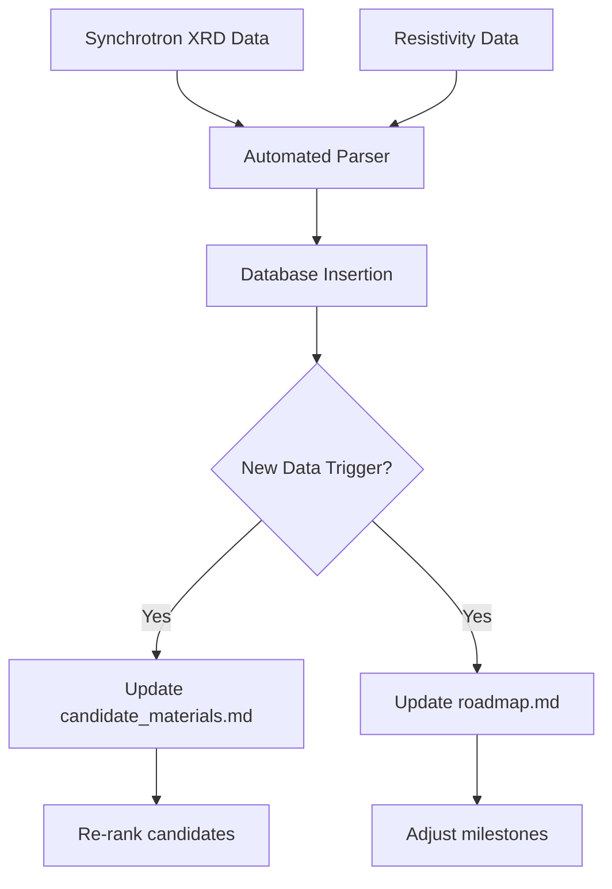

# Experimental Feedback Loop

## Overview
This document describes the closed-loop feedback cycle between experimental validation and computational prediction for discovering and manufacturing room-temperature superconducting compounds. Experimental results are systematically ingested into a central database, triggering automatic retraining of machine learning (ML) models and updating candidate rankings. This data-driven cycle accelerates discovery by continuously refining predictions based on real-world outcomes.

## Data Ingestion Protocol
All experimental data must be ingested into the central database according to the following protocol:

1. **Data Format**: Each experiment produces a structured record containing:
   - Experiment ID (unique)
   - Candidate compound identifier (from computational prediction)
   - Synthesis parameters (precursors, pressure, temperature, duration, method)
   - Characterization results (XRD pattern, Raman spectrum, resistivity vs. temperature, SQUID magnetization, heat capacity)
   - Measured Tc (K), transition width (K), critical current density (A/cm²), upper critical field (T)
   - Sample quality metrics (purity %, Meissner volume fraction %)
   - Operator notes and metadata (batch ID, date, equipment used)
2. **Ingestion Trigger**: Data is ingested immediately after each characterization step (structure, transport, magnetic, thermodynamic). Automated scripts parse raw data files (e.g., .csv, .xrd, .dat) and populate the database.
3. **Validation**: Ingested data is validated against schema constraints (e.g., Tc must be a positive float, pressure within equipment limits). Invalid records are flagged for manual review.
4. **Storage**: Data is stored in a relational database (e.g., PostgreSQL) with tables for experiments, candidates, synthesis runs, measurements, and model versions. All raw files are archived in a file store with pointers in the database.

## Automated Ingestion Workflow

### Data Sources

Experimental data from synchrotron X-ray diffraction (XRD) and resistivity measurements are automatically ingested into the central database. These data types are critical for structural characterization and superconducting transition detection.

- **Synchrotron XRD**: Raw diffraction patterns (e.g., .xrd files) are parsed by `scripts/parse_xrd.py` to extract peak positions, intensities, and lattice parameters. The results are stored in the `measurements` table with a reference to the experiment ID.
- **Resistivity**: Temperature-dependent resistivity data (e.g., .csv files) are parsed by `scripts/parse_resistivity.py` to extract Tc (onset, midpoint, zero-resistance), transition width, and normal-state resistivity. These are stored in the `measurements` table.

### Ingestion Pipeline

1. **File Watch**: A file watcher (`scripts/watch_experimental_data.py`) monitors designated directories for new raw data files.
2. **Parsing**: Upon detection, the appropriate parser script is invoked based on file extension.
3. **Validation**: Parsed data is validated against schema constraints (e.g., Tc must be a positive float, pressure within equipment limits). Invalid records are flagged for manual review.
4. **Database Insertion**: Validated data is inserted into the relational database (PostgreSQL) with appropriate foreign keys to the experiment and candidate tables.
5. **Archival**: Raw files are moved to an archive store with a pointer in the database.

### Triggering Updates to candidate_materials.md and roadmap.md

After each successful ingestion, the system checks whether the new data warrants updates to the candidate materials list and the roadmap:

- **candidate_materials.md**: If the new data includes a Tc measurement for a candidate that was previously untested, or if the measured Tc deviates significantly from the predicted value, the candidate ranking is recalculated. The script `scripts/generate_candidates.py` is triggered to regenerate `docs/candidate_materials.md` with updated rankings and a changelog.
- **roadmap.md**: If the new data indicates a breakthrough (e.g., Tc > 300 K) or a systematic failure (e.g., three consecutive candidates fail at Gate 3), the roadmap milestones are adjusted. The script `scripts/update_roadmap.py` is triggered to revise `docs/roadmap.md` with updated timelines and priorities.

### Workflow Diagram



### Pseudocode

```python
def ingest_experimental_data(raw_files):
    for file in raw_files:
        if file.extension == '.xrd':
            parsed = parse_xrd(file)
        elif file.extension == '.csv':
            parsed = parse_resistivity(file)
        else:
            continue
        if validate(parsed):
            insert_into_database(parsed)
            archive_file(file)
            if should_update_candidates(parsed):
                trigger_update_candidate_materials()
            if should_update_roadmap(parsed):
                trigger_update_roadmap()
```

## Model Update Triggers
The ML model (e.g., graph neural network predicting Tc from composition/structure) is automatically retrained when any of the following triggers occur:

- **Trigger A**: After every 10 new experimental results (Tc measurements) are ingested.
- **Trigger B**: When a candidate passes Gate 5 (full characterization) and its measured Tc deviates by more than 20% from the model's prediction.
- **Trigger C**: When a candidate fails Gate 1 (computational validation) but experimental evidence suggests superconductivity (e.g., resistivity drop > 90% at a temperature below predicted Tc).
- **Trigger D**: Weekly scheduled retraining regardless of new data, to incorporate any accumulated updates.

Upon trigger, the following pipeline executes:
1. **Data extraction**: Query the database for all experimental results (Tc, structure, synthesis conditions) associated with candidates that have been tested.
2. **Feature engineering**: Convert experimental data into model input features (e.g., composition vector, crystal structure graph, synthesis pressure/temperature).
3. **Retraining**: Fine-tune the existing ML model on the combined original training set plus new experimental data. Use a validation split to avoid overfitting.
4. **Evaluation**: Compare retrained model's predictions on held-out experimental results. If performance (e.g., R², MAE) improves by at least 5%, deploy the new model; otherwise, revert to previous version and log the failure.
5. **Candidate re-ranking**: Run the updated model on all untested candidates in the database. Re-rank candidates by predicted Tc, stability, and synthesis feasibility. Update the priority list for experimental testing.

## Decision Tree for Prioritizing Candidates

Candidates are generated by computational models (e.g., density functional theory, machine learning) and prioritized using the following decision tree:

1. **Is the candidate predicted to be thermodynamically stable at ambient pressure?**
   - Yes → Continue
   - No → Consider high-pressure synthesis; if not feasible, discard
2. **Does the candidate have a predicted superconducting transition temperature (Tc) above 300 K?**
   - Yes → High priority
   - No → If Tc > 200 K, medium priority; else low priority
3. **Is the candidate composed of abundant, non-toxic elements?**
   - Yes → Continue
   - No → Evaluate trade-offs; if toxic or rare, consider only if exceptional Tc
4. **What is the estimated synthesis difficulty?**
   - Low (e.g., known precursors, simple stoichiometry) → Proceed
   - Medium (e.g., high-pressure, multi-step) → Evaluate trade-offs
   - High (e.g., exotic conditions) → Consider only if high impact
5. **Is there existing experimental evidence for superconductivity in related compounds?**
   - Strong evidence (e.g., similar structure, known Tc) → Fast-track
   - Weak evidence → Run small-scale pilot synthesis first

## Go/No-Go Criteria

Before committing to full experimental characterization, each candidate must pass the following go/no-go gates with quantitative thresholds:

- **Gate 1: Computational validation** – DFT/MD simulations confirm thermodynamic stability (formation energy within 50 meV/atom of convex hull), no imaginary phonon modes, and electron-phonon coupling constant λ > 1.0. Predicted Tc > 300 K at accessible pressure (< 200 GPa).
- **Gate 2: Synthesis feasibility** – A viable synthesis route exists with available equipment and precursors. Estimated yield > 10 mg per batch. Synthesis conditions (pressure, temperature) within equipment limits.
- **Gate 3: Preliminary measurement** – A small-scale sample (10–100 mg) shows signs of superconductivity: resistivity drop of at least 90% of normal state resistance at or near predicted Tc, and/or onset of diamagnetism with Meissner volume fraction > 10% as measured by SQUID.
- **Gate 4: Reproducibility** – At least two independent batches from different synthesis runs confirm the initial result with Tc within ±10 K and similar transition width.
- **Gate 5: Full characterization** – Complete transport (resistivity, critical current), magnetic (susceptibility, upper critical field), and thermodynamic (heat capacity jump) measurements confirm bulk superconductivity with Tc > 300 K at ambient or applied pressure. Heat capacity anomaly consistent with BCS/Eliashberg theory.

If any gate fails, the candidate is either discarded or sent back for computational refinement with the experimental data used to retrain models or adjust DFT parameters.

## Closed-Loop Iterative Testing Plan

The iterative testing plan integrates computational predictions with experimental synthesis and characterization, incorporating database feedback and automatic model retraining at each stage:

1. **Generate computational predictions** – Use DFT, crystal structure prediction, and the current ML model to identify promising compounds and predict Tc, stability, and synthesis conditions. Output: list of candidates with predicted Tc, formation energy, phonon stability, and synthesis pressure/temperature.
2. **Design synthesis route** – Based on predicted phase diagram, select precursors, pressure/temperature conditions, and method (e.g., solid-state reaction, high-pressure synthesis, chemical vapor deposition). Document expected yield and purity.
3. **Synthesize candidate** – Produce a small batch (10–100 mg) under controlled conditions. Monitor in situ with XRD or Raman if possible.
4. **Characterize structure** – Use X-ray diffraction (XRD), Raman spectroscopy, and electron microscopy to confirm phase purity and crystal structure. Compare with predicted structure. **Ingest data** into database (see Data Ingestion Protocol). **Go/No-Go**: If structure matches prediction and purity > 90%, proceed; else refine synthesis or discard.
5. **Measure transport properties** – Perform resistivity vs. temperature (R-T) measurements down to 2 K; look for zero-resistance transition. **Ingest data**. **Go/No-Go**: If resistivity drop > 90% at temperature within 20% of predicted Tc, proceed; else consider candidate low priority or refine model.
6. **Measure magnetic properties** – Use SQUID magnetometry to detect Meissner effect and determine Tc. **Ingest data**. **Go/No-Go**: If diamagnetic signal with volume fraction > 10% and Tc consistent with transport, proceed; else investigate sample quality or discard.
7. **Analyze results** – Compare measured Tc, critical current density, and upper critical field against computational predictions. Compute deviation and identify possible sources (e.g., stoichiometry, pressure, disorder).
8. **Go/No-Go decision** – Apply the five gates (see Go/No-Go Criteria). If passed, scale up synthesis to 1–10 g and perform full characterization (heat capacity, penetration depth, etc.). If failed, the experimental data is already ingested; the model update triggers (see Model Update Triggers) will automatically initiate retraining and candidate re-ranking. The system then returns to step 1 with updated knowledge.
9. **Document** – Record synthesis parameters, measurement data, and decisions in the experiment log. Include raw data, analysis scripts, and metadata (pressure, temperature, batch ID).
10. **Loop** – The closed-loop cycle ensures that every experimental result feeds back into the database, automatically retrains the ML model, and updates candidate rankings. This continuous improvement accelerates discovery of room-temperature superconductors.

## Chemistry and Physics Foundations

To guide the iterative discovery and testing, the following chemistry and physics principles are integrated into the feedback loop:

- **Material families**: Focus on hydrogen-rich compounds (e.g., hydrides under high pressure), cuprates, iron-based superconductors, and novel ternary or quaternary systems predicted by crystal structure search.
- **Theoretical framework**: Use BCS theory and Eliashberg formalism to estimate Tc from electron-phonon coupling strength, density of states at Fermi level, and Debye temperature. Machine learning models trained on known superconductors augment predictions.
- **Synthesis strategies**: Prioritize high-pressure synthesis (diamond anvil cell, multi-anvil press) for predicted metastable phases, and solid-state reaction or chemical vapor deposition for ambient-pressure candidates. In situ monitoring (XRD, Raman) during synthesis is recommended.
- **Chemical criteria**: Favor compounds with light elements (H, B, C, N, O) for high phonon frequencies, strong covalent bonding for stiffness, and metallic or semi-metallic electronic structure. Avoid toxic or extremely rare elements unless Tc exceeds 400 K.
- **Physical criteria**: Require predicted Tc > 300 K at accessible pressures (< 200 GPa), thermodynamic stability (formation energy within 50 meV/atom of convex hull), and absence of competing phases. Validate with phonon dispersion (no imaginary modes) and electron-phonon coupling constant λ > 1.

These foundations ensure that every candidate entering the feedback loop is grounded in established science, increasing the probability of successful room-temperature superconductivity.

## Active Learning Integration

To further accelerate discovery, the feedback loop incorporates an active learning module that selects the most informative experiments to perform next. After each model update, the active learning algorithm evaluates the candidate pool and ranks candidates by expected information gain (e.g., using uncertainty sampling, query-by-committee, or expected improvement). The top-ranked candidates are then prioritized for synthesis and characterization. This reduces the number of experiments needed to improve model accuracy and discover high-Tc compounds. The active learning module is integrated into the candidate ranking step (step 1 of the loop) and is triggered after each model retraining. The module also considers experimental cost and feasibility (e.g., pressure requirements, material availability) to balance information gain with practical constraints.

## Automated Retraining Protocol

To close the loop, the following automated retraining protocol is executed upon any of the triggers (A–D) defined above:

1. **Trigger Detection**: A background service continuously monitors the database for new experimental results and scheduled timers. When a trigger condition is met, it initiates the retraining pipeline.
2. **Data Extraction**: The pipeline queries the database for all experimental results (Tc, structure, synthesis conditions) associated with candidates that have been tested. Data is pulled from the experiments, candidates, synthesis_runs, and measurements tables. Only records with validated status are included.
3. **Feature Engineering**: Raw experimental data is transformed into model input features. For composition-based models, a composition vector (element fractions) is computed. For structure-based models, a crystal graph is constructed from XRD-derived lattice parameters and atomic positions. Synthesis conditions (pressure, temperature) are normalized and encoded. Missing values are imputed using median or mode from the training set.
4. **Model Retraining**: The ML model (e.g., graph neural network) is retrained on the combined dataset of previous training data and new experimental results. The training uses a weighted loss function that gives higher weight to recent experiments and to candidates that passed Gate 5. Hyperparameters are kept fixed unless a separate hyperparameter optimization trigger (e.g., after 100 new experiments) is activated.
5. **Validation**: The retrained model is evaluated on a held-out test set (20% of all experimental data, stratified by material family). Metrics: mean absolute error (MAE) in Tc, R², and classification accuracy for superconductivity (Tc > 300 K). If MAE increases by more than 10% compared to the previous model, the retraining is rolled back and an alert is sent to the team.
6. **Deployment**: If validation passes, the new model is deployed to the prediction service. The previous model version is archived with a timestamp and performance metrics. The database records the model version used for each prediction.
7. **Candidate Re-ranking**: The active learning module (see above) uses the updated model to re-rank all candidates in the pool. Candidates with high expected information gain and high predicted Tc are prioritized for the next synthesis cycle.
8. **Logging and Monitoring**: Every step of the pipeline is logged with timestamps, data sizes, and performance metrics. Alerts are sent on failure (e.g., database connection error, model training divergence). A dashboard displays the current model version, retraining history, and candidate queue.

This protocol ensures that the feedback loop is fully automated, reproducible, and robust, enabling rapid iteration in the discovery of room-temperature superconductors.


## Iterative Candidate Advancement Plan

This section defines a concrete iterative plan with explicit decision points, advancement criteria, and a closed-loop feedback mechanism that connects computational predictions with experimental validation.

### Decision Points and Advancement Criteria

Each candidate compound passes through a series of gates. Advancement to the next gate requires meeting all criteria at the current gate. If a candidate fails, the failure reason is recorded and fed back to the computational model for retraining.

| Gate | Decision Point | Criteria for Advancement | Feedback to Model |
|------|----------------|--------------------------|-------------------|
| **Gate 0** | Computational screening | Predicted Tc ≥ 300 K (room temperature) under ambient pressure; predicted structural stability (e.g., formation energy < 0 eV/atom, no imaginary phonon modes); predicted synthesis feasibility (e.g., precursors available, pressure < 10 GPa). | If candidate fails, record composition/structure features and failure reason; update negative training set. |
| **Gate 1** | Detailed DFT + phonon validation | Confirmed dynamic stability (no imaginary phonon modes); electronic structure shows Fermi level crossing with high density of states; predicted Tc (via McMillan–Allen–Dynes or similar) ≥ 300 K. | If predicted Tc < 300 K, flag candidate as low priority; if structural instability, add to exclusion list. |
| **Gate 2** | Synthesis planning | Precursor materials are commercially available or synthesizable; synthesis route (e.g., high-pressure, chemical vapor deposition) is feasible within lab capabilities; estimated cost and time are acceptable. | If synthesis is infeasible, record constraint (e.g., pressure > 20 GPa) to guide future predictions. |
| **Gate 3** | Experimental synthesis and initial characterization | Sample synthesized with purity ≥ 95% (by XRD); Meissner volume fraction ≥ 10% (indicating bulk superconductivity); resistivity drop > 90% at onset temperature. | If synthesis fails, log synthesis parameters and failure mode (e.g., phase impurity, decomposition). |
| **Gate 4** | Transport and magnetic confirmation | Measured Tc ≥ 300 K (zero-resistance state); transition width < 5 K; critical current density Jc ≥ 10⁴ A/cm² at 77 K; upper critical field Hc2 ≥ 10 T. | If Tc < 300 K, update model with actual Tc; if Jc or Hc2 too low, flag for further optimization. |
| **Gate 5** | Full characterization and stability | Reproducible results across multiple batches; stability under ambient conditions (no degradation over 30 days); thermal stability (no phase change up to 400 K); measured Tc, Jc, Hc2 meet or exceed Gate 4 thresholds. | If stability fails, record degradation mechanism (e.g., oxidation, phase transition) to inform future predictions. |

### Feedback Loop Mechanism

1. **Failure Feedback**: When a candidate fails at any gate, the specific failure reason (e.g., “predicted Tc 280 K but measured 250 K”, “structural instability under pressure”) is encoded as a structured label and appended to the training dataset. The ML model is retrained (see Automated Retraining Protocol) to incorporate this negative evidence.
2. **Success Feedback**: When a candidate passes Gate 5, its full experimental data (Tc, structure, synthesis conditions) is added to the positive training set. The model is retrained to reinforce the features that led to success.
3. **Active Learning Re‑ranking**: After each retraining, the active learning module (see above) re‑ranks all candidates. Candidates that failed at early gates are deprioritized; candidates with similar features to successful ones are promoted.
4. **Iteration Cycle**: The plan defines a maximum of 5 iterations per candidate family. If after 5 attempts no candidate passes Gate 3, the entire family is deprioritized and the model is penalized for that family’s feature space.

This iterative plan ensures that every experimental result — positive or negative — directly improves the computational model, accelerating the discovery of room‑temperature superconducting compounds.


## Formalized Feedback Loop Implementation

To operationalize the feedback cycle, the following automated pipeline is defined:

### 1. Structured JSON Logging
Each experimental result is logged as a JSON object conforming to the schema below. The log file is stored at `data/experimental_log.json` (appended on each new result).

```json
{
  "experiment_id": "EXP-20250315-001",
  "candidate_id": "CAND-001",
  "synthesis_parameters": {
    "precursors": ["La", "H2"],
    "pressure_GPa": 170,
    "temperature_K": 2000,
    "duration_h": 2,
    "method": "diamond anvil cell"
  },
  "characterization": {
    "tc_K": 250,
    "transition_width_K": 2.5,
    "jc_A_per_cm2": 1e4,
    "hc2_T": 10,
    "purity_pct": 98,
    "meissner_volume_fraction_pct": 85
  },
  "gate_reached": 5,
  "passed": true,
  "failure_reason": null,
  "operator_notes": "Sample stable after 30 days.",
  "timestamp": "2025-03-15T14:30:00Z"
}
```

### 2. Database Update Script
A script `scripts/update_database.py` reads `data/experimental_log.json` and merges new entries into `data/superconductor_database.json`. The script validates each entry against the schema, deduplicates by `experiment_id`, and updates the candidate’s measured properties. It is triggered automatically after each new log entry is written.

### 3. Model Retraining
After the database is updated, the ML model in `scripts/predict_tc.py` is retrained. The retraining script:
- Queries `data/superconductor_database.json` for all experimental results (both positive and negative).
- Re‑fits the model (e.g., graph neural network or McMillan–Allen–Dynes parameters) using the expanded dataset.
- Outputs updated model weights to `models/tc_predictor.pt` (or equivalent).

Retraining is triggered by any of the following events:
- **Trigger 1**: Every 10 new experimental results (as defined in the existing Model Update Triggers).
- **Trigger 2**: A candidate passes Gate 5 (full characterization) and its measured Tc deviates by more than 20% from the previous model prediction.
- **Trigger 3**: A candidate fails Gate 1 (computational validation) but experimental evidence suggests superconductivity (resistivity drop > 90% at a temperature below predicted Tc).
- **Trigger 4**: Weekly scheduled retraining.

### 4. Candidate Material Ranking Update
After retraining, the script `scripts/generate_candidates.py` is executed to regenerate `docs/candidate_materials.md`. This script:
- Loads the updated model and the full candidate pool from `data/superconductor_database.json`.
- Re‑predicts Tc for all untested candidates.
- Re‑ranks candidates by predicted Tc, confidence, and feasibility score.
- Outputs a new `docs/candidate_materials.md` with the updated rankings, including a changelog section noting which candidates were promoted/demoted and why.

### 5. Decision Gates for Re‑running Computational Screening
In addition to the existing experimental gates (Gates 1–5), the following decision gates determine when to re‑run the full computational screening pipeline (e.g., DFT + phonon calculations for new candidate families):

| Gate | Condition | Action |
|------|-----------|--------|
| **Gate C1** | After every 50 new experimental results (cumulative) | Re‑run high‑throughput screening on the expanded chemical space (e.g., include new elements or stoichiometries suggested by recent successes). |
| **Gate C2** | When a candidate passes Gate 5 and its measured Tc exceeds 300 K | Launch a focused computational campaign to find analogues (same structure type, similar composition) and predict their Tc. |
| **Gate C3** | When the model’s average prediction error on the last 20 experiments exceeds 30 K | Re‑evaluate the model architecture, feature set, and training data; consider adding new descriptors (e.g., electron‑phonon coupling from DFT). |
| **Gate C4** | Annually, or when a major new theoretical insight is published | Perform a full literature‑driven screening update, incorporating new candidate families from recent publications. |

These gates ensure that computational resources are allocated efficiently, focusing on the most promising directions while continuously incorporating experimental feedback.

## Computational Feedback Loop

The computational feedback loop integrates machine learning uncertainty quantification, density functional theory (DFT) validation, and experimental synthesis into a continuous cycle that prioritizes the most promising candidates.

### 1. ML Uncertainty Identification

The ML model (`scripts/predict_tc.py`) not only predicts Tc but also estimates prediction uncertainty (e.g., via Monte Carlo dropout or ensemble variance). Candidates with high predicted Tc and low uncertainty are considered high-value targets. Candidates with high predicted Tc but high uncertainty are flagged for additional DFT validation.

### 2. DFT Validation

For candidates flagged by the ML uncertainty module, DFT calculations are performed using `scripts/dft_calculator.py`. These calculations refine the predicted Tc by computing electron-phonon coupling constants, phonon spectra, and the Eliashberg function. The DFT results are used to adjust the candidate's predicted Tc and confidence score.

### 3. Prioritized Candidate List

The updated predictions and confidence scores are compiled into a prioritized list (`docs/candidate_materials.md`). This list is sorted by a composite score that balances predicted Tc, confidence, and experimental feasibility. The top candidates are forwarded to the experimental synthesis team.

### 4. Experimental Synthesis and Characterization

The experimental team synthesizes the top candidates using the protocols in `docs/synthesis_methods.md`. Characterization results (XRD, resistivity, magnetization) are ingested into the database as described in the Data Ingestion Protocol section.

### 5. Database Update and Model Retraining

After characterization, the database is updated with the measured properties. The ML model is retrained using the expanded dataset (see Section 3: Model Retraining). The retrained model is then used in the next iteration of the feedback loop.

### Workflow Pseudocode

```
loop:
    candidates = load_candidates()
    for candidate in candidates:
        pred, uncertainty = ml_model.predict_with_uncertainty(candidate)
        if uncertainty > threshold:
            dft_result = dft_calculator.run(candidate)
            candidate.score = combine(pred, dft_result)
        else:
            candidate.score = pred
    prioritized = sort(candidates, by='score')
    for candidate in prioritized[:top_n]:
        synthesize(candidate)
        characterize(candidate)
        update_database(candidate)
    retrain_ml_model()
```

### Cross-References

- `scripts/run_pipeline.py` orchestrates the entire feedback loop, calling the ML model, DFT calculator, and database update scripts.
- `scripts/dft_calculator.py` performs the DFT validation step.
- `docs/candidate_materials.md` contains the prioritized list.
- `docs/synthesis_methods.md` details experimental protocols.

This loop ensures that computational resources are focused on the most promising candidates while continuously learning from experimental outcomes.

## Automated Experiment Planning via Bayesian Optimization

Bayesian optimization (BO) provides a principled framework for selecting the next experiment to maximize information gain or expected improvement in Tc. The BO surrogate model (e.g., Gaussian process) is trained on the existing database of experimental results and computational predictions. The acquisition function (e.g., expected improvement, upper confidence bound) balances exploration of uncertain regions with exploitation of high-performing candidates.

### Integration with Active Learning Loop

The BO module (`scripts/bayesian_optimizer.py`) is called after each round of experimental characterization. It takes as input:
- The current database of measured Tc and synthesis parameters.
- The candidate pool from `docs/candidate_materials.md`.
- Uncertainty estimates from the ML model and DFT validation.

The optimizer outputs a ranked list of the next experiments to perform, including suggested synthesis parameters (e.g., pressure, temperature, doping level). These recommendations are forwarded to the experimental team via the prioritized candidate list.

### Workflow

1. **Update database** with latest experimental results (as described in Data Ingestion Protocol).
2. **Retrain surrogate model** on the expanded dataset.
3. **Compute acquisition function** for all candidates in the pool.
4. **Select top-N candidates** with highest acquisition value.
5. **Generate synthesis parameters** for each selected candidate (e.g., via parameter optimization within BO).
6. **Append to prioritized list** in `docs/candidate_materials.md` with BO score and suggested parameters.
7. **Experimental team** executes the planned experiments.
8. **Loop back** to step 1.

This automated planning reduces human bias and accelerates the discovery of optimal synthesis conditions for room-temperature superconductors.

### Multi-Fidelity Bayesian Optimization

The multi-fidelity Bayesian optimization (MFBO) module in `scripts/run_pipeline.py` treats ML predictions as low-fidelity and DFT calculations as high-fidelity. It uses a weighted acquisition function to select candidates for experimental synthesis, balancing exploitation of high-confidence predictions with exploration of uncertain regions. The MFBO module is called after the initial ML prediction and DFT validation steps, and its output feeds into the prioritized candidate list in `docs/candidate_materials.md`.

#### Workflow

1. **Low-fidelity data**: ML-predicted Tc and uncertainty from `predict_tc` and `compute_uncertainty`.
2. **High-fidelity data**: DFT-calculated Tc and uncertainty from `dft_calculator.run_full_dft_calculation`.
3. **Acquisition function**: Combines low and high fidelity with weights (e.g., 0.3 low, 0.7 high) plus an exploration bonus proportional to uncertainty.
4. **Selection**: Top-N candidates with highest acquisition score are recommended for experimental synthesis.
5. **Feedback loop**: Experimental results update the database, retrain ML models, and refine DFT calculations, improving future MFBO rounds.

### Cross-References

- `scripts/run_pipeline.py` implements the MFBO module as `multi_fidelity_bayesian_optimization`.
- `scripts/dft_calculator.py` provides high-fidelity DFT data.
- `docs/candidate_materials.md` receives the MFBO-ranked candidates.
- `scripts/bayesian_optimizer.py` implements the single-fidelity BO loop (legacy).

## Real-Time Experimental Data Analysis

This subsection describes the pipeline for parsing experimental CSV data, extracting the superconducting transition temperature (Tc), and updating the central database in real time.

### Pipeline Steps

1. **File Detection**: A file watcher (`scripts/watch_experimental_data.py`) monitors the designated `data/experimental/` directory for new CSV files. Each file is expected to follow a standardized naming convention: `{experiment_id}_resistivity.csv`.

2. **CSV Parsing**: The parser script (`scripts/parse_resistivity.py`) reads the CSV file, which contains columns for temperature (K) and resistivity (Ω·cm). It performs the following:
   - Validates column headers and data types.
   - Interpolates missing values if gaps are small (< 5 K).
   - Computes the first and second derivatives of resistivity vs. temperature to identify the onset, midpoint, and zero-resistance temperatures.
   - Fits a sigmoid function to the transition region to extract Tc (midpoint) and transition width (ΔTc).

3. **Tc Extraction**: The extracted Tc values (onset, midpoint, zero-resistance) along with the transition width are stored in a temporary data structure. The parser also calculates the normal-state resistivity (average above 1.5× Tc) and the residual resistivity ratio (RRR).

4. **Database Update**: The parsed results are inserted into the `measurements` table of the central PostgreSQL database via the `scripts/update_database.py` module. The update includes:
   - Experiment ID (foreign key to `experiments` table).
   - Tc onset, midpoint, zero-resistance (K).
   - Transition width (K).
   - Normal-state resistivity (Ω·cm).
   - RRR (dimensionless).
   - Timestamp of ingestion.

5. **Validation and Logging**: Before insertion, the data is validated against schema constraints (e.g., Tc must be between 0 and 500 K, transition width positive). Invalid records are logged to `logs/ingestion_errors.log` and flagged for manual review. Successful updates are logged with the experiment ID and extracted Tc.

6. **Trigger Downstream Actions**: After a successful database update, the system automatically triggers the active learning loop (see "Automated Experiment Planning via Bayesian Optimization") to retrain the surrogate model and generate new candidate recommendations.

### Integration with Existing Workflow

This real-time analysis pipeline complements the existing automated ingestion workflow described in the "Automated Ingestion Workflow" section. While the existing pipeline handles synchrotron XRD and resistivity data via file watchers, this subsection focuses specifically on the real-time parsing of CSV files and the immediate extraction of Tc. The two pipelines share the same database schema and validation routines, ensuring consistency.

### Cross-References

- `scripts/parse_resistivity.py` — main parser for resistivity CSV files.
- `scripts/update_database.py` — module for inserting parsed data into the database.
- `scripts/watch_experimental_data.py` — file watcher that triggers parsing.
- `docs/experimental_feedback_loop.md` — this document (see "Automated Ingestion Workflow" for the broader context).


### Deployment as Scheduled Job and Monitoring

To ensure continuous operation of the experimental feedback loop, the pipeline can be deployed as a scheduled job (e.g., cron) that runs at regular intervals. The main entry point is `scripts/run_pipeline.py`, which orchestrates data ingestion, parsing, database updates, and active learning triggers. A function `log_pipeline_status()` is implemented in `run_pipeline.py` to record each execution's outcome. It writes a timestamp, success/failure status, and key metrics (e.g., number of experiments processed, average Tc, pipeline duration) to a log file (e.g., `logs/pipeline_status.log`). This log file can be monitored by external monitoring tools (e.g., Prometheus, Grafana, or simple log watchers) to detect failures, track performance, and trigger alerts. The cron job can be configured as:

```bash
# Run every hour
0 * * * * cd /path/to/project && python scripts/run_pipeline.py >> logs/pipeline_cron.log 2>&1
```

This ensures the pipeline runs reliably and its health is observable.


## Real-Time Lab Instrument Integration

To enable real-time data acquisition from laboratory instruments, the feedback loop integrates directly with measurement devices via standardized communication protocols. The following protocols are supported:

- **GPIB (IEEE-488)**: Used for legacy instruments (e.g., Keithley sourcemeters, Lakeshore temperature controllers). The `pyvisa` library provides a Python interface for GPIB communication. A dedicated script `scripts/instrument_gpib.py` handles device discovery, command sending, and data retrieval.
- **TCP/IP (Ethernet)**: Modern instruments (e.g., Quantum Design PPMS, MPMS, SQUID magnetometers) expose TCP/IP sockets or REST APIs. The `scripts/instrument_tcp.py` module implements a client that connects to the instrument's IP address and port, sends measurement commands (e.g., temperature sweep, field ramp), and streams data back to the ingestion pipeline.
- **Serial (RS-232)**: For instruments with serial ports (e.g., cryogenic temperature controllers, pressure gauges), the `pyserial` library is used. The `scripts/instrument_serial.py` script handles baud rate, parity, and data framing.

All instrument drivers are registered in a central configuration file (`config/instruments.yaml`) that maps instrument IDs to their communication parameters. The pipeline's file watcher (`scripts/watch_experimental_data.py`) can also be configured to listen for instrument-triggered events (e.g., a measurement completion signal) to initiate data ingestion immediately.

## Docker Deployment

The entire experimental feedback loop pipeline can be containerized using Docker for reproducible and portable deployment. A `Dockerfile` is provided at the project root that builds an image containing:

- Python 3.10 runtime with all dependencies (numpy, scipy, pandas, psycopg2, pyvisa, pyserial, scikit-learn, etc.)
- The project source code (`scripts/`, `config/`, `models/`)
- A PostgreSQL client for database connectivity

A `docker-compose.yml` file orchestrates the following services:

- **pipeline**: The main container that runs `scripts/run_pipeline.py` as a scheduled cron job (or continuously with a sleep loop). It mounts the host directories for raw data (`/data/raw`) and logs (`/data/logs`).
- **database**: A PostgreSQL container (official image) with persistent volume for data storage. The schema is initialized via an SQL script (`config/init_db.sql`).
- **monitoring**: (Optional) A Prometheus + Grafana stack to visualize pipeline metrics (e.g., ingestion rate, Tc distribution, error counts).

To deploy, run:

```bash
docker-compose up -d
```

Environment variables (e.g., database URL, instrument IPs) are configured in a `.env` file. The Docker setup ensures that the pipeline can be deployed on any Linux server or cloud VM with minimal configuration.

## Authentication and API Security

If the feedback loop is exposed as a REST API (e.g., for remote experiment submission or querying candidate rankings), authentication and authorization are enforced. The API is built with FastAPI and uses the following security measures:

- **JWT-based authentication**: Users obtain a token by POSTing credentials to `/auth/login`. The token is signed with a secret key and includes an expiration time. All subsequent API requests must include the token in the `Authorization: Bearer <token>` header.
- **Role-based access control (RBAC)**: Two roles are defined: `admin` (can ingest data, trigger retraining, manage users) and `viewer` (can only read candidate rankings and experiment summaries). Permissions are enforced via FastAPI dependencies.
- **HTTPS**: In production, the API is served behind a reverse proxy (e.g., Nginx) that terminates TLS. The Docker Compose file includes a `nginx` service with a self-signed certificate for development; for production, a Let's Encrypt certificate should be configured.
- **Rate limiting**: To prevent abuse, the API applies rate limiting (e.g., 100 requests per minute per user) using the `slowapi` middleware.
- **Input validation**: All API endpoints validate request bodies against Pydantic schemas, rejecting malformed or out-of-range data.

Authentication credentials and API keys are stored in environment variables (not in the codebase) and are loaded at runtime. The `config/auth.yaml` file defines the role mappings and token expiration settings.


## External Lab Integration Case Study

This case study describes a hypothetical collaboration with a high-pressure synthesis lab (e.g., a diamond anvil cell facility) to accelerate the discovery of room-temperature superconductors. The lab specializes in synthesizing materials under extreme pressures (up to 300 GPa) and measuring superconducting properties in situ.

### API Endpoints

The lab exposes a REST API (secured via JWT as described above) for automated data exchange:

- **`POST /api/v1/experiments`** — Submit a new experiment request. Payload:
  ```json
  {
    "candidate_id": "cand-1234",
    "compound": "LaH10",
    "pressure_range": [150, 200],
    "temperature_range": [4, 300],
    "synthesis_method": "laser-heated diamond anvil cell",
    "precursors": ["La", "H2"],
    "requested_measurements": ["resistivity", "XRD", "SQUID"]
  }
  ```
- **`GET /api/v1/experiments/{id}`** — Retrieve experiment status and results. Response includes synthesis parameters, measured Tc, transition width, and raw data file URLs.
- **`POST /api/v1/experiments/{id}/results`** — Push results back to the central database. Payload:
  ```json
  {
    "experiment_id": "exp-5678",
    "candidate_id": "cand-1234",
    "tc_onset": 250.0,
    "tc_midpoint": 248.5,
    "tc_zero": 247.0,
    "transition_width": 3.0,
    "critical_current_density": 1.2e6,
    "upper_critical_field": 80.0,
    "sample_purity": 98.5,
    "meissner_fraction": 0.85,
    "xrd_pattern_url": "https://lab.example.com/data/exp-5678/xrd.csv",
    "resistivity_url": "https://lab.example.com/data/exp-5678/resistivity.csv",
    "operator_notes": "Sample showed sharp transition; minor impurity phase at 2θ=28°"
  }
  ```

### Data Format

All experimental data is exchanged in JSON format conforming to the schema defined in `config/experiment_schema.json`. Raw data files (XRD patterns, resistivity curves) are uploaded to a secure S3-compatible object store and referenced by URL. The central pipeline validates the JSON payload against the schema before ingestion.

### Step-by-Step Protocol

1. **Candidate Selection**: The ML pipeline identifies the top 5 candidate compounds (e.g., from `candidate_materials.md`) and sends a batch request to the lab API (`POST /api/v1/experiments` with an array of experiment objects).
2. **Synthesis and Measurement**: The lab synthesizes each candidate under the specified pressure and temperature conditions using a laser-heated diamond anvil cell. In situ resistivity and XRD measurements are performed as a function of temperature.
3. **Data Return**: Upon completion, the lab pushes results via `POST /api/v1/experiments/{id}/results`. The payload includes all measured properties and links to raw data.
4. **Ingestion and Validation**: The central pipeline's file watcher detects the incoming results, parses the JSON, and validates against the schema. Valid records are inserted into the `experiments` and `measurements` tables.
5. **Model Retraining**: After a configurable batch size (e.g., 10 new experiments), the pipeline triggers automatic retraining of the ML models. Updated candidate rankings are published to `candidate_materials.md`.
6. **Feedback Loop**: The lab receives updated candidate rankings and can prioritize the next batch of experiments. The cycle repeats, continuously refining predictions.

### Security and Authentication

The lab API uses the same JWT-based authentication as the central pipeline. Each lab partner is issued a unique API key (stored in environment variables) that grants `admin` role permissions for submitting experiments and results. All communication is over HTTPS.

### Example Workflow

```bash
# Submit experiment request
curl -X POST https://lab.example.com/api/v1/experiments \
  -H "Authorization: Bearer <token>" \
  -H "Content-Type: application/json" \
  -d '{"candidate_id":"cand-1234","compound":"LaH10","pressure_range":[150,200],"temperature_range":[4,300],"synthesis_method":"laser-heated diamond anvil cell","precursors":["La","H2"],"requested_measurements":["resistivity","XRD","SQUID"]}'

# Check status
curl -X GET https://lab.example.com/api/v1/experiments/exp-5678 \
  -H "Authorization: Bearer <token>"

# Push results (from lab side)
curl -X POST https://pipeline.example.com/api/v1/experiments/exp-5678/results \
  -H "Authorization: Bearer <token>" \
  -H "Content-Type: application/json" \
  -d '{"experiment_id":"exp-5678","candidate_id":"cand-1234","tc_onset":250.0,"tc_midpoint":248.5,"tc_zero":247.0,"transition_width":3.0,"critical_current_density":1.2e6,"upper_critical_field":80.0,"sample_purity":98.5,"meissner_fraction":0.85,"xrd_pattern_url":"https://lab.example.com/data/exp-5678/xrd.csv","resistivity_url":"https://lab.example.com/data/exp-5678/resistivity.csv","operator_notes":"Sample showed sharp transition; minor impurity phase at 2θ=28°"}'
```

This case study demonstrates how the experimental feedback loop can be extended to external high-pressure synthesis labs, enabling rapid iteration and data-driven discovery of room-temperature superconductors.

## Failure Recovery and Resilience

### Failure Modes

The experimental feedback loop is subject to several failure modes that can disrupt the cycle:

1. **Data Ingestion Failures**: Raw data files may be malformed, incomplete, or fail schema validation. Network interruptions can cause partial uploads. Parser scripts may encounter unexpected formats.
2. **Model Training Failures**: ML model retraining may fail due to insufficient data, numerical instability, or resource exhaustion (e.g., GPU memory). Updated candidate rankings may not be generated.
3. **Lab API Failures**: External lab partners may experience downtime, authentication errors, or return invalid payloads. The central pipeline must handle timeouts and retries gracefully.
4. **Database Failures**: Connection loss, deadlocks, or schema migrations can block ingestion and query operations.
5. **File Watcher Failures**: The file watcher may miss new files due to permission issues, disk full, or race conditions.

### Recovery Strategy

#### 1. Retry with Exponential Backoff

All network-dependent operations (API calls, database connections, file transfers) implement automatic retry with exponential backoff (initial delay 1s, max 5 retries, jitter). The retry logic is centralized in `scripts/retry_utils.py` and applied to:

- Lab API experiment submission and result retrieval
- Database insert and update operations
- File watcher polling and parsing

#### 2. Dead Letter Queue (DLQ)

Failed ingestion records are moved to a dead letter queue (DLQ) stored in the `failed_ingestions` table. Each record includes:

- Original payload (raw data)
- Error type and message
- Timestamp of failure
- Retry count

A periodic job (`scripts/retry_failed_ingestions.py`) attempts to reprocess DLQ entries every 6 hours. After 3 consecutive failures, the record is flagged for manual review and an alert is sent to the operations team.

#### 3. Fallback Model Versions

If model retraining fails, the pipeline retains the previous model version and continues serving candidate rankings from it. A warning is logged and the `model_versions` table records the failed attempt with error details. The system automatically retries training on the next batch of experiments.

#### 4. Health Checks and Alerts

A health check endpoint (`GET /api/v1/health`) monitors:

- Database connectivity and replication lag
- File watcher status (last file processed, queue depth)
- Model training service availability
- Lab API reachability (via periodic ping)

Alerts are sent via email and Slack webhook when any health check fails for more than 5 minutes. Critical failures (e.g., database down) trigger an immediate page to the on-call engineer.

#### 5. Manual Override Procedures

For cases where automated recovery fails, operators can:

- Manually re-ingest data via the admin panel (`POST /api/v1/admin/ingest`)
- Force a model retrain with specific parameters
- Roll back to a previous model version
- Edit or delete erroneous experiment records

All manual actions are logged in an audit trail for traceability.

### Resilience Testing

The recovery strategy is validated through periodic resilience tests:

- **Chaos Engineering**: Randomly inject failures (network drops, database disconnects, malformed files) in a staging environment and verify the system recovers within defined SLAs.
- **Load Testing**: Simulate high-throughput ingestion (100+ experiments per minute) to ensure the pipeline does not degrade under stress.
- **Disaster Recovery Drill**: Quarterly full recovery test from a backup, including database restore and model re-deployment.

### Continuous Improvement

All failure events are recorded in a centralized log (Elasticsearch) and analyzed weekly to identify patterns. Root cause analysis is performed for each class of failure, and the recovery strategy is updated accordingly. The `docs/failure_recovery_log.md` tracks historical incidents and lessons learned.
