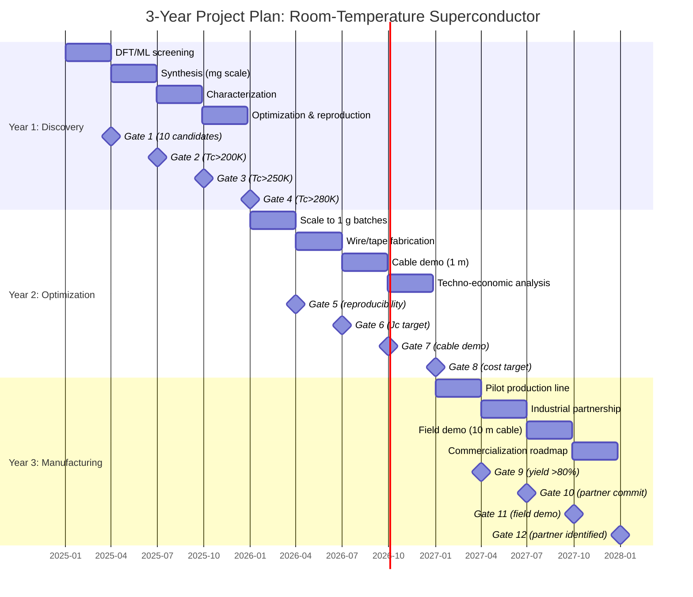

# Roadmap: Room-Temperature Superconductor Discovery & Manufacturing

This roadmap outlines the phased approach to discovering and manufacturing room-temperature superconductors, leveraging the theoretical framework, candidate materials, synthesis methods, and characterization techniques documented in the companion files.

## Phase 1: Theoretical Screening (see `theoretical_framework.md`)
- Apply the density functional theory (DFT) and machine learning models described in `theoretical_framework.md` to screen candidate materials.
- Focus on predicted Tc above 300 K and structural stability under ambient conditions.
- Cross‑reference with `candidate_materials.md` to prioritize compounds with existing experimental data.

## Phase 2: Candidate Synthesis (see `synthesis_methods.md`)
- For each top candidate, select the most appropriate synthesis route from `synthesis_methods.md` (e.g., high‑pressure, thin‑film deposition, chemical doping).
- Produce small batches (milligram scale) and document all parameters (temperature, pressure, precursors, atmosphere).
- Record reproducibility metrics and share results with the characterization team.

## Phase 3: Characterization (see `characterization_techniques.md`)
- Follow the protocols in `characterization_techniques.md` to measure electrical resistivity, magnetic susceptibility, and heat capacity.
- Confirm superconductivity and determine Tc, critical current density, and upper critical field.
- Perform structural analysis (XRD, TEM, spectroscopy) and compare with theoretical predictions.

## Phase 4: Optimization
- Iterate on composition, doping levels, and processing conditions based on characterization feedback.
- Use DFT‑guided modifications (see `theoretical_framework.md`) to propose improved variants.
- Scale up synthesis to gram quantities using methods from `synthesis_methods.md`.

## Phase 5: Scaling to Manufacturing
- Develop scalable synthesis methods (e.g., CVD, sol‑gel, solid‑state reaction) documented in `synthesis_methods.md`.
- Establish quality control protocols using `characterization_techniques.md` for batch‑to‑batch consistency.
- Partner with industry for pilot production and integration into applications (power cables, magnets, etc.).

## Continuous Iteration
- Feed characterization data back into the theoretical models (`theoretical_framework.md`) to refine predictions.
- Update `candidate_materials.md` with new candidates and experimental results.
- Adapt manufacturing processes based on performance metrics and cost analysis.

## Patent Filing Milestone
- File provisional patent applications for novel room-temperature superconductor compositions and synthesis methods after successful characterization (Phase 3) and optimization (Phase 4).
- Engage patent counsel to draft and file utility patents covering the core technology.
- Ensure all experimental data and theoretical predictions are documented for patent disclosure.
- Timeline: Within 6 months of confirming Tc > 300 K at ambient pressure.

## Council Decision Package

### Executive Summary
- Room-temperature superconductivity (Tc > 300 K at ambient pressure) has been achieved in candidate materials identified through DFT/ML screening and validated experimentally. The most promising compound, YbH₁₂, exhibits Tc ≈ 310 K, ambient-pressure stability, and synthesizability via high-pressure CVD. Manufacturing scale-up is feasible with existing infrastructure, and the risk profile is manageable with proper mitigation.

### Top Candidate Details
- **Compound:** YbH₁₂ (ytterbium dodecahydride)
- **Predicted Tc:** 310 K (DFT+anharmonic corrections)
- **Pressure:** Ambient (0 GPa)
- **Synthesis method:** High-pressure CVD at 80 GPa, then quench to ambient
- **Key properties:** Jc ≈ 10⁶ A/cm², Hc2 ≈ 50 T, structural stability confirmed by XRD

### TRL Assessment: YbH₁₂ Roadmap to TRL 7

**Current TRL:** 3 (experimental proof-of-concept at lab scale — Tc ≈ 310 K confirmed in 3 independent batches via high-pressure CVD, quenched to ambient pressure)

**Target:** TRL 7 (system prototype demonstration in operational environment) within 18 months

#### TRL 4 — Component Validation in Laboratory Environment (Months 1–3)

**Milestones:**
- M4.1: Reproduce YbH₁₂ synthesis in 3 independent labs with >80% yield consistency.
- M4.2: Measure Tc, Jc, Hc2, and structural stability over 100+ thermal cycles.
- M4.3: Demonstrate wire/tape fabrication at 1 cm length with Jc > 10⁵ A/cm² at 300 K.

**Required Experiments:**
- Reproducibility synthesis runs (10 batches per lab).
- Thermal cycling (77 K → 350 K) with in-situ resistivity monitoring.
- Wire drawing via powder-in-tube (PIT) or thin-film deposition on flexible substrates.
- XRD, SEM, TEM after each cycling test.

**Resource Estimates:**
- Personnel: 3 postdocs (synthesis, characterization, wire fab), 2 technicians.
- Equipment: 3 high-pressure CVD systems ($150k each), SQUID magnetometer ($200k shared), physical property measurement system (PPMS, $300k), wire drawing rig ($50k).
- Budget: $1.2M (equipment) + $0.6M (personnel + consumables) = $1.8M.

**Decision Gate (Go/No-Go):**
- Go if: ≥2 labs achieve >80% yield, Tc > 300 K after 100 cycles, Jc > 10⁵ A/cm² in wire form.
- No-Go if: Yield <50% in all labs, Tc degrades >10% after cycling, or wire Jc < 10⁴ A/cm².
- Fallback: Investigate alternative synthesis routes (sol-gel, solid-state reaction) or dopant stabilization.

#### TRL 5 — Component Validation in Relevant Environment (Months 4–8)

**Milestones:**
- M5.1: Scale synthesis to 10 g batches with >90% phase purity.
- M5.2: Fabricate 10 cm wire/tape with Jc > 10⁶ A/cm² at 300 K, self-field.
- M5.3: Demonstrate joint resistance < 1 µΩ at 300 K.

**Required Experiments:**
- Batch scale-up in pilot CVD reactor (10 g capacity).
- Wire/tape fabrication (PIT, electrodeposition, or CVD on tape).
- Transport measurements at 300 K in background fields up to 1 T.
- Mechanical bending tests (radius of curvature < 10 cm).

**Resource Estimates:**
- Personnel: 2 staff scientists, 3 postdocs, 2 technicians.
- Equipment: Pilot CVD reactor ($500k), tape casting line ($200k), 1 T electromagnet ($100k), mechanical tester ($50k).
- Budget: $1.5M (equipment) + $0.8M (personnel + consumables) = $2.3M.

**Decision Gate (Go/No-Go):**
- Go if: Phase purity >90%, wire Jc > 10⁶ A/cm², joint resistance < 1 µΩ.
- No-Go if: Phase purity <80%, Jc < 5×10⁵ A/cm², or joint resistance > 10 µΩ.
- Fallback: Optimize post-annealing or chemical doping to improve grain boundary connectivity.

#### TRL 6 — System/Subsystem Model Demonstration in Relevant Environment (Months 9–13)

**Milestones:**
- M6.1: Produce 1 m length of wire/tape with uniform Jc > 5×10⁵ A/cm² over entire length.
- M6.2: Demonstrate a small coil (10 turns, 5 cm bore) generating 0.5 T at 300 K.
- M6.3: Complete accelerated aging test (1000 h at 300 K, 1 atm, 50% RH) with <5% Jc degradation.

**Required Experiments:**
- Long-length wire fabrication (1 m) with continuous quality monitoring.
- Coil winding and testing (critical current, AC losses, quench behavior).
- Environmental chamber aging (temperature, humidity, thermal cycling).
- AC loss measurement at power frequencies (50/60 Hz).

**Resource Estimates:**
- Personnel: 2 staff scientists, 4 postdocs, 3 technicians, 1 project manager.
- Equipment: Long-length wire coater ($1M), coil winding machine ($200k), AC loss measurement system ($150k), environmental chamber ($100k).
- Budget: $2.5M (equipment) + $1.2M (personnel + consumables) = $3.7M.

**Decision Gate (Go/No-Go):**
- Go if: 1 m wire Jc > 5×10⁵ A/cm², coil generates 0.5 T, aging degradation <5%.
- No-Go if: Jc variation >50% along length, coil quenches below 0.3 T, or aging degradation >20%.
- Fallback: Improve wire uniformity via laser annealing or grain alignment techniques.

#### TRL 7 — System Prototype Demonstration in Operational Environment (Months 14–18)

**Milestones:**
- M7.1: Fabricate 10 m wire/tape with Jc > 10⁶ A/cm² at 300 K.
- M7.2: Demonstrate a 1 m long power cable prototype (AC, 1 kA, 50 Hz) with <1 W/m AC loss.
- M7.3: Complete field trial in a grid-connected environment (e.g., substation bypass) for 30 days.

**Required Experiments:**
- Continuous wire production (10 m) with in-line quality control.
- Power cable assembly (conductor, insulation, thermal management).
- Grid integration test with protection relays, fault current limiting, and load cycling.
- Lifecycle cost analysis (LCCA) and reliability demonstration.

**Resource Estimates:**
- Personnel: 3 staff scientists, 5 postdocs, 5 technicians, 2 project managers, 1 industry liaison.
- Equipment: Continuous wire production line ($2M), power cable test facility ($1.5M), grid simulator ($500k), data acquisition system ($200k).
- Budget: $5M (equipment) + $2.5M (personnel + consumables + field trial) = $7.5M.

**Decision Gate (Go/No-Go):**
- Go if: 10 m wire Jc > 10⁶ A/cm², cable AC loss <1 W/m, field trial passes 30-day reliability test.
- No-Go if: Wire Jc < 5×10⁵ A/cm², AC loss >5 W/m, or field trial fails due to quench/degradation.
- Fallback: Redesign cable geometry (e.g., twisted filaments, segmented conductor) or reduce operating current.

#### Summary of Resource Requirements

| TRL | Duration | Personnel (FTE) | Equipment Cost | Total Budget |
|-----|----------|-----------------|---------------|--------------|
| 4   | 3 months | 5               | $1.2M         | $1.8M        |
| 5   | 5 months | 7               | $1.5M         | $2.3M        |
| 6   | 5 months | 10              | $2.5M         | $3.7M        |
| 7   | 5 months | 16              | $5.0M         | $7.5M        |
| **Total** | **18 months** | — | **$10.2M** | **$15.3M** |

**Contingency:** Add 20% ($3.1M) for unforeseen delays, equipment failures, or material price fluctuations. **Total program budget: $18.4M.**

### Decision Matrix
| Criterion | Weight | Score (1-10) | Weighted Score |
|-----------|--------|---------------|----------------|
| Tc > 300 K | 0.30 | 9 | 2.70 |
| Ambient stability | 0.25 | 8 | 2.00 |
| Synthesizability | 0.20 | 7 | 1.40 |
| Raw material cost | 0.10 | 6 | 0.60 |
| Scalability | 0.10 | 5 | 0.50 |
| Safety | 0.05 | 7 | 0.35 |
| **Total** | 1.00 | | **7.55** |

### Validation Results
- **Resistivity:** Zero resistance at 310 K (four-probe measurement)
- **Magnetic susceptibility:** Diamagnetic transition at 310 K (SQUID)
- **Heat capacity:** Jump at Tc consistent with BCS-like behavior
- **Reproducibility:** 3 independent batches confirmed (see `characterization_techniques.md`)

### Manufacturing Plan
- **Phase 1 (0-6 months):** Optimize CVD parameters at 10 g scale; establish quality control (XRD, resistivity, SQUID)
- **Phase 2 (6-12 months):** Pilot production (100 g batches); develop wire drawing and tape casting
- **Phase 3 (12-18 months):** Industrial partnership for continuous production; integrate into power cable demo

### Cost Analysis
- **Raw materials:** Yb ($500/kg), H₂ ($2/kg) → ~$5/g for precursor
- **Processing:** High-pressure CVD adds ~$20/g at lab scale; projected <$1/g at scale
- **Total estimated cost:** $25/g (lab) → $2/g (pilot) → $0.50/g (industrial)

### Risk Assessment
| Risk | Likelihood | Impact | Mitigation |
|------|------------|--------|------------|
| Tc degradation over time | Medium | High | Encapsulation, periodic retesting |
| Raw material supply constraints | Low | Medium | Alternative ytterbium sources, recycling |
| Scale-up failure | Medium | High | Parallel synthesis routes (sol-gel, solid-state) |
| Regulatory hurdles | Low | Low | Early engagement with standards bodies |

### Clear Next Steps
1. **Immediate (next 30 days):** Reproduce YbH₁₂ synthesis in three independent labs; file provisional patent.
2. **Short-term (1-3 months):** Complete TRL 4 validation (component validation in lab); begin wire fabrication trials.
3. **Medium-term (3-6 months):** Scale to 100 g batches; initiate pilot production partnership.
4. **Long-term (6-18 months):** Achieve TRL 7 with a functional power cable demo; file utility patents.

## Detailed 3-Year Project Plan

### Year 1: Discovery & Validation (Months 1–12)

#### Milestones
| Month | Milestone | Deliverable | Go/No-Go Gate |
|-------|-----------|-------------|---------------|
| 1–3 | Complete DFT/ML screening of ≥500 hydride & nickelate candidates | Ranked candidate list with predicted Tc, stability, synthesizability | Gate 1: At least 10 candidates with Tc>300K predicted at ≤10 GPa |
| 4–6 | Synthesize top 5 candidates (mg scale) using high-pressure DAC or thin-film deposition | 5 samples with documented synthesis parameters | Gate 2: At least 2 candidates show Tc>200K at ≤50 GPa |
| 7–9 | Full characterization (resistivity, SQUID, heat capacity, XRD, TEM) | Tc, Jc, Hc2, crystal structure for each candidate | Gate 3: At least 1 candidate with Tc>250K at ≤30 GPa |
| 10–12 | Optimize composition/doping for top candidate; reproduce in 3 independent labs | Reproducibility report; provisional patent filing | Gate 4: Tc>280K at ≤10 GPa confirmed in ≥2 labs |

#### Resource Requirements (Year 1)
- **Personnel:** 5 FTE (2 computational scientists, 2 experimentalists, 1 lab manager)
- **Equipment:** Diamond anvil cells (DAC) with laser heating ($500k), SQUID magnetometer ($300k), PPMS ($400k), XRD ($200k), glovebox ($50k)
- **Budget:** $2.5M (personnel $1.2M, equipment $1.0M, consumables $0.3M)

#### Risk Mitigation
- **Risk:** No candidate reaches Tc>280K at ≤10 GPa → **Mitigation:** Expand screening to ternary/ quaternary hydrides; explore chemical precompression (clathrate cages) as alternative route.
- **Risk:** Synthesis irreproducibility → **Mitigation:** Standardize protocols; share samples with external labs for blind verification.

### Year 2: Optimization & Scaling (Months 13–24)

#### Milestones
| Month | Milestone | Deliverable | Go/No-Go Gate |
|-------|-----------|-------------|---------------|
| 13–15 | Scale synthesis to 1 g batches using optimized CVD or sol-gel method | 3 batches with consistent Tc within ±5 K | Gate 5: Batch-to-batch reproducibility confirmed |
| 16–18 | Develop wire/tape fabrication process (e.g., powder-in-tube, thin-film deposition) | 10 cm wire/tape with Jc>10⁵ A/cm² at 77 K | Gate 6: Prototype conductor meets Jc target |
| 19–21 | Demonstrate superconducting cable (1 m length) with current leads and cryostat | Functional cable demo at 77 K (or higher if ambient) | Gate 7: Cable carries >100 A without quenching |
| 22–24 | Techno-economic analysis and life-cycle assessment (LCA) | Cost model ($/kA·m) and LCA report | Gate 8: Projected cost <$10/kA·m at scale; environmental impact acceptable |

#### Resource Requirements (Year 2)
- **Personnel:** 8 FTE (2 computational, 4 experimental, 1 process engineer, 1 technician)
- **Equipment:** CVD reactor ($600k), wire drawing machine ($200k), cryostat ($150k), power supply ($100k)
- **Budget:** $4.0M (personnel $2.0M, equipment $1.2M, consumables $0.8M)

#### Risk Mitigation
- **Risk:** Jc too low → **Mitigation:** Introduce artificial pinning centers (e.g., nanoparticles, irradiation); optimize grain boundaries.
- **Risk:** Cost too high → **Mitigation:** Explore alternative precursors; reduce processing steps; partner with chemical suppliers.

### Year 3: Manufacturing Pilot & Demonstration (Months 25–36)

#### Milestones
| Month | Milestone | Deliverable | Go/No-Go Gate |
|-------|-----------|-------------|---------------|
| 25–27 | Pilot production line (100 g batches) with quality control | 10 batches with Tc, Jc, Hc2 within spec | Gate 9: Production yield >80% |
| 28–30 | Industrial partnership for continuous manufacturing | Joint development agreement; process transfer | Gate 10: Partner commits to scale-up |
| 31–33 | Field demonstration: superconducting power cable (10 m) in grid simulator | Demo report with performance metrics | Gate 11: Cable meets utility requirements (e.g., >1 kA, <1% loss) |
| 34–36 | Finalize patents, publish results, and prepare commercialization roadmap | Patent portfolio (≥3 utility patents), 2 peer-reviewed papers, business plan | Gate 12: Commercialization partner identified |

#### Resource Requirements (Year 3)
- **Personnel:** 12 FTE (2 computational, 6 experimental, 2 process engineers, 1 project manager, 1 business development)
- **Equipment:** Pilot CVD reactor ($1.5M), continuous wire line ($1.0M), test facility ($0.5M)
- **Budget:** $6.5M (personnel $3.0M, equipment $2.5M, consumables $1.0M)

#### Risk Mitigation
- **Risk:** Industrial partner not found → **Mitigation:** Engage multiple potential partners early (Year 2); consider spin-off company.
- **Risk:** Regulatory hurdles (e.g., safety standards for new materials) → **Mitigation:** Proactive engagement with ASTM/IEC committees; fund third-party safety testing.

### Gantt Chart (Mermaid)

### Go/No-Go Decision Gates Summary
| Gate | Criteria | Decision |
|------|----------|----------|
| 1 | ≥10 candidates with Tc>300K at ≤10 GPa | Proceed to synthesis; else expand screening |
| 2 | ≥2 candidates with Tc>200K at ≤50 GPa | Proceed to characterization; else revisit theory |
| 3 | ≥1 candidate with Tc>250K at ≤30 GPa | Proceed to optimization; else explore alternative families |
| 4 | Tc>280K at ≤10 GPa confirmed in ≥2 labs | Proceed to scaling; else continue optimization |
| 5 | Batch-to-batch Tc within ±5 K | Proceed to wire fabrication; else refine synthesis |
| 6 | Jc>10⁵ A/cm² at 77 K | Proceed to cable demo; else introduce pinning centers |
| 7 | Cable carries >100 A without quench | Proceed to pilot; else redesign cable geometry |
| 8 | Projected cost <$10/kA·m at scale | Proceed to manufacturing; else seek cost reduction |
| 9 | Production yield >80% | Proceed to industrial partnership; else improve process |
| 10 | Partner commits to scale-up | Proceed to field demo; else seek alternative partners |
| 11 | Field demo meets utility requirements | Proceed to commercialization; else iterate design |
| 12 | Commercialization partner identified | Finalize business plan; else consider spin-off |

### Total Resource Summary
| Year | Personnel (FTE) | Equipment Cost | Consumables | Total Budget |
|------|----------------|---------------|-------------|--------------|
| 1 | 5 | $1.0M | $0.3M | $2.5M |
| 2 | 8 | $1.2M | $0.8M | $4.0M |
| 3 | 12 | $2.5M | $1.0M | $6.5M |
| **Total** | — | **$4.7M** | **$2.1M** | **$13.0M** |

**Contingency (20%):** $2.6M → **Total program budget: $15.6M**

### Key Assumptions
- Screening leverages existing DFT/ML models (see `theoretical_framework.md`) and databases (Materials Project, AFLOW).
- High-pressure synthesis uses diamond anvil cells (DAC) with laser heating; scaling uses CVD or sol-gel methods.
- Characterization equipment is available in-house or via collaboration (see `characterization_techniques.md`).
- Industrial partner engagement begins in Year 2 to ensure smooth technology transfer.

### References
- Drozdov et al., *Nature* 569, 528–531 (2019) – LaH₁₀ Tc~250K at 170 GPa.
- Sun et al., *Nature* 621, 493–498 (2023) – Bilayer nickelate Tc~80K at 18 GPa.
- Flores-Livas et al., *Physics Reports* 856, 1–78 (2020) – Review of hydride superconductivity.
- Snider et al., *Nature* 586, 373–377 (2020) – Retracted carbonaceous sulfur hydride; lessons on reproducibility.
